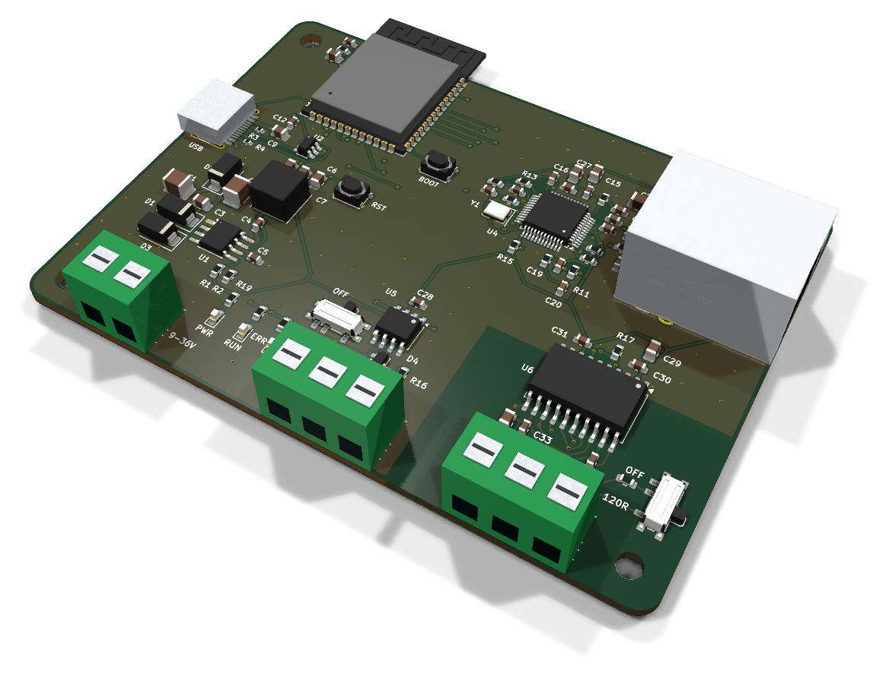
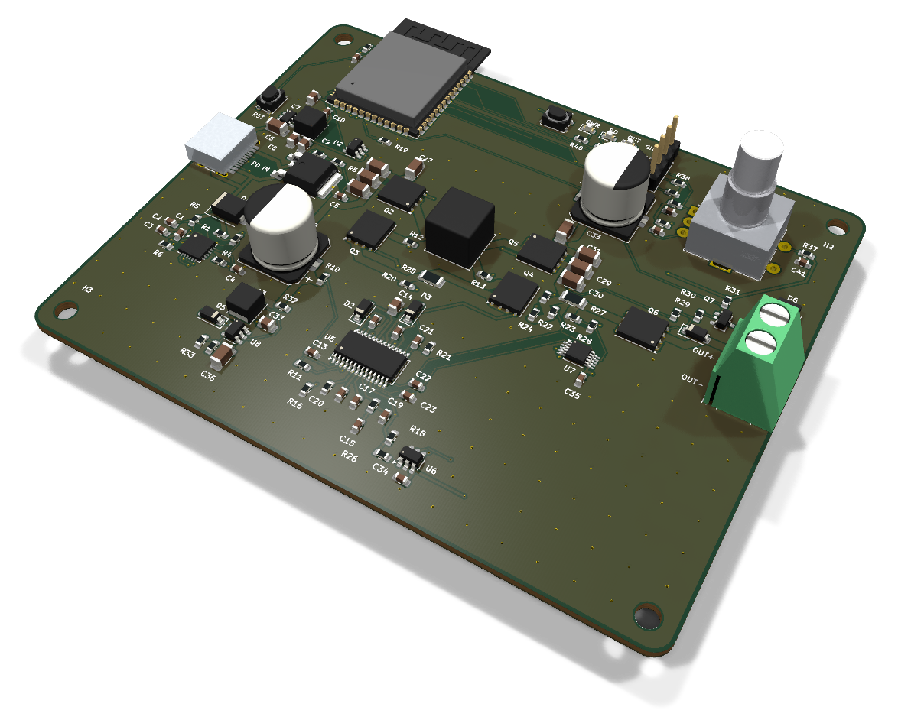
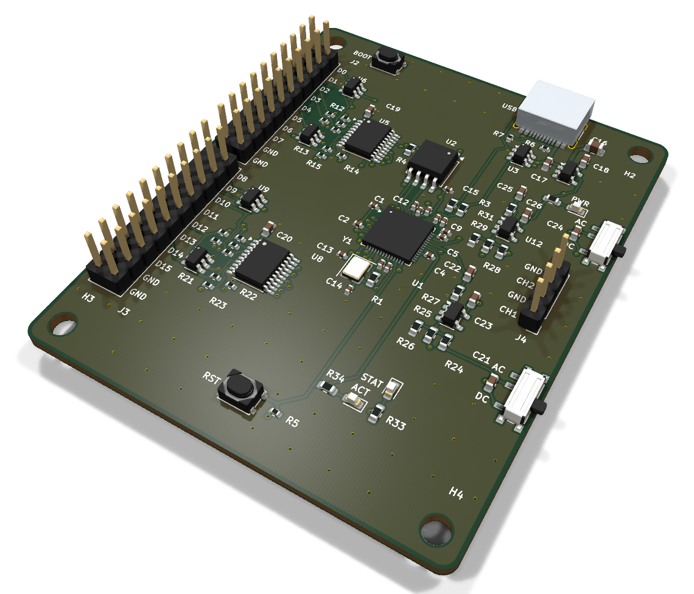
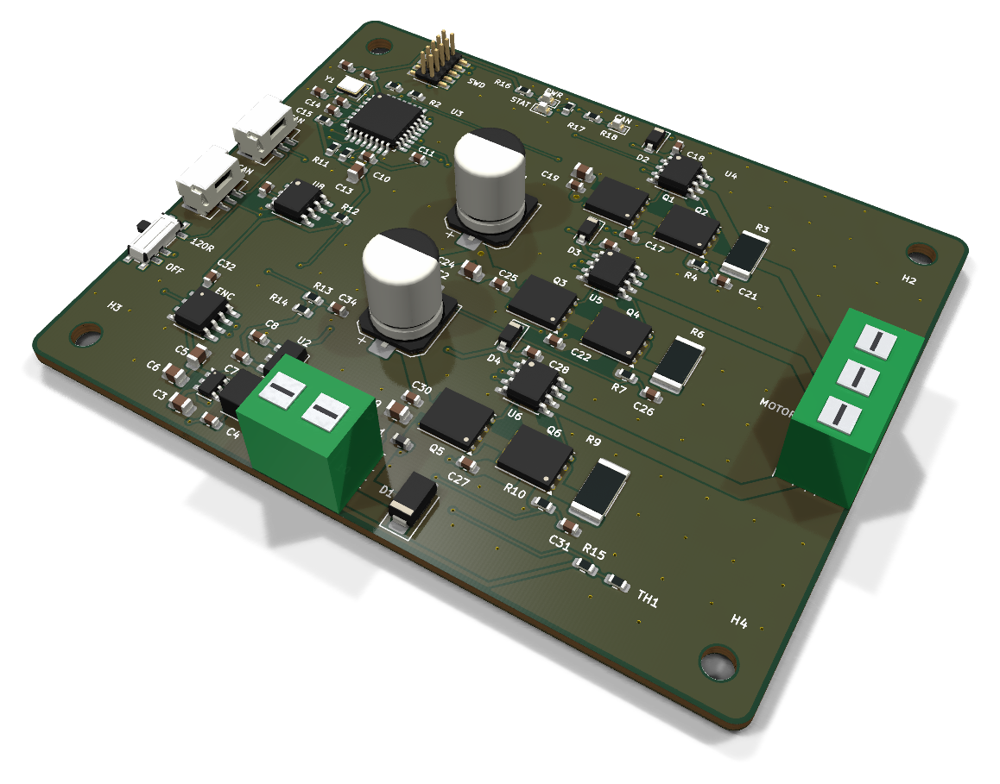
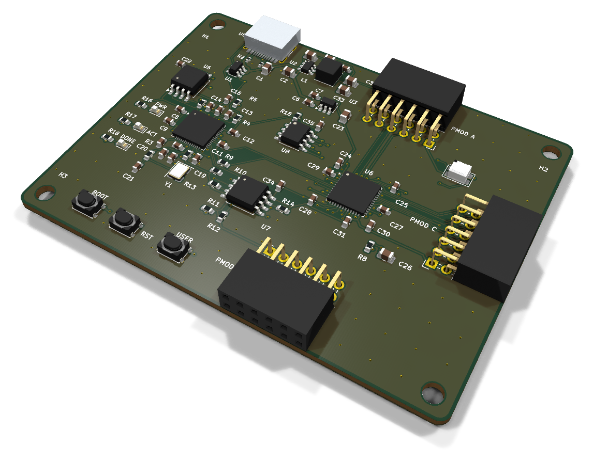

# KiCad projects

Five boards, each designed end to end in KiCad 10 and checked by KiCad itself: schematic, ERC, netlist round
trip, placement, routing, pours, silkscreen, DRC with schematic parity, DFM and fab outputs. Each folder holds
the KiCad project, the gerbers / BOM / pick-and-place / STEP, raytraced renders and a video of the design
being built step by step.

<table>
<tr><td align="center" width="50%"><a href="iron-node/"></a><br><b><a href="iron-node/">Iron Node</a></b><br><sub>An ESP32-S3 industrial gateway with Ethernet, isolated RS-485, CAN and a 9-36 V input.</sub></td><td align="center" width="50%"><a href="pd-brick/"></a><br><b><a href="pd-brick/">PD Brick</a></b><br><sub>A USB-C Power Delivery bench supply: STUSB4500 sink, LM5176 buck-boost, 1.2-22 V set over I2C by an ESP32-S3.</sub></td></tr>
<tr><td align="center" width="50%"><a href="probelab/"></a><br><b><a href="probelab/">ProbeLab</a></b><br><sub>An RP2040 USB-C logic analyzer: 16 buffered 5 V-tolerant inputs plus two low-speed scope channels.</sub></td><td align="center" width="50%"><a href="spinner/"></a><br><b><a href="spinner/">Spinner</a></b><br><sub>A 12-24 V field-oriented-control BLDC motor controller: STM32G431, three IR2104 half bridges, MT6701 encoder, CAN FD.</sub></td></tr>
<tr><td align="center" width="50%"><a href="ice-core/"></a><br><b><a href="ice-core/">Ice Core</a></b><br><sub>A 6-layer iCE40UP5K FPGA board with 8 MB PSRAM and three Pmods, programmed and clocked over USB-C by an RP2040.</sub></td></tr>
</table>

## The boards

| Board | Layers | Size | Parts | Nets | Connections routed | Vias | DRC errors / unconnected / parity |
|---|---|---|---|---|---|---|---|
| [Iron Node](iron-node/) | 4 | 90 x 66 mm | 83 | 57 | 215 -> 0 | 135 | 0 / 0 / 0 |
| [PD Brick](pd-brick/) | 4 | 100 x 80 mm | 120 | 71 | 283 -> 0 | 208 | 0 / 0 / 0 |
| [ProbeLab](probelab/) | 4 | 58 x 70 mm | 88 | 84 | 253 -> 0 | 171 | 0 / 0 / 0 |
| [Spinner](spinner/) | 4 | 84 x 66 mm | 87 | 52 | 205 -> 0 | 167 | 0 / 0 / 0 |
| [Ice Core](ice-core/) | 6 | 80 x 60 mm | 78 | 73 | 234 -> 0 | 180 | 0 / 0 / 0 |

Every number above is read from the board's own `report.json`, written by the run that produced the files.

## How they were made

The boards were designed with the HeyPCB method on KiCad 10.0.6, headless: a written brief is composed from
reusable circuit blocks, every pin comes from KiCad's own symbol library, every part is bound to an LCSC
number from a dated catalogue lookup, and each stage is gated by a measurement:

```
brief -> blocks -> schematic -> ERC -> netlist round trip -> board -> placement -> Freerouting 2.4.1
      -> last-mile router -> pours + stitching (only at 0 open) -> silkscreen -> DRC + schematic parity
      -> DFM -> fab gate -> gerbers / BOM / CPL / STEP -> renders -> design-process video
```

A stage that could not measure holds the run; nothing is assumed to pass. Each board's README lists the chip
substitutions made along the way, the design decisions, and what to check before ordering.

## Status

None of these boards has been fabricated, assembled or powered, and no firmware or gateware ships with them.
They pass every check KiCad can run; they have not met a soldering iron. Part numbers and stock are dated
catalogue snapshots: re-check them before ordering.

## License

Hardware designs: [CERN-OHL-S v2](LICENSE). KiCad's symbol, footprint and 3D libraries used in the designs are
CC-BY-SA 4.0 with the KiCad library exception. 3D bodies under `kicad/models/` are simplified envelopes
generated for parts whose KiCad model is missing, not vendor models.
