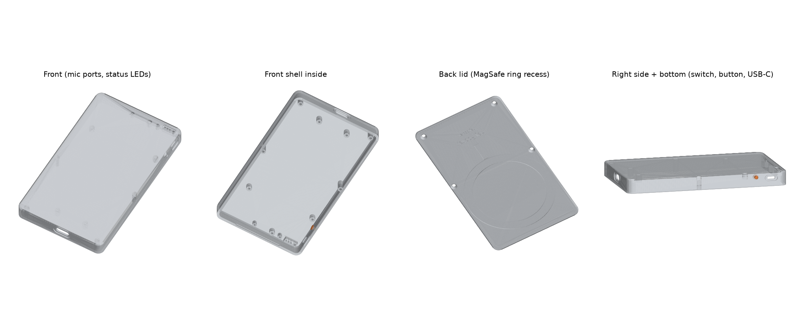

# HeyPocket

A MagSafe voice recorder: an Ebyte E73 nRF52840 BLE module, two TDK T3902 PDM microphones, 512 MB of
SD-NAND, a TP4056 Li-ion charger, and USB-C on a small daughterboard joined by a 10-pin FFC. Every part
was picked from what LCSC / JLC actually stocks.

| Board | Layers | Size | Thickness | Parts (assembled) | DRC |
|---|---|---|---|---|---|
| Main | 4 | 50 x 26 mm | 1.0 mm | 51 (46) | 0 routing violations (see the SW2 note) |
| USB-C | 2 | 24 x 16 mm | 1.0 mm | 5 (5) | 0 violations |

**Not fabricated, assembled or powered. No firmware yet.** The boards were designed in EasyEDA Pro
(project `heypocket-heypcb`) and checked with EasyEDA's own DRC against JLCPCB rules: 0.1 mm track and
space, 0.45 / 0.25 mm vias, 0.3 mm copper to board edge. The only DRC flags left are two inside the ALPS
SKRTLAE010 library footprint itself: its GND pads 1 and 3 sit 0.076 mm from the switch's own peg holes.
The enclosure was checked against the board outlines and part heights in CAD only.

| | |
|---|---|
| Gerbers, LCSC BOM, JLC CPL (both boards) | [`fab/`](fab/) |
| Enclosure STEP / STL, CAD source, fit report | [`enclosure/`](enclosure/) |

## What's on the main board

- **MCU:** Ebyte E73-2G4M08S1C (nRF52840, ceramic antenna) in the top-left corner, with the antenna end on the board edge and a copper keep-out on every layer under it. There is no 32.768 kHz crystal, so firmware runs the low-frequency clock from the calibrated internal RC. SWD on five 2.54 mm pads (J6, left empty).
- **Audio:** two TDK T3902 (MMICT390200012, 64 dB SNR) bottom-port PDM mics, one per channel (SELECT to GND and to VDD), on the back of the board, ported through 0.5 mm holes. Their supply is switched by an AO3401A (P0.12, active low), and a red REC LED (LED4) sits on that supply, so it lights whenever the mics are powered, whatever the firmware does.
- **Storage:** MKDV4GCL-ABF 512 MB SD-NAND, wired for SPI. That is about 18 hours of 16 kHz IMA-ADPCM, or about 70 hours of 16 kbps Opus.
- **Power:** TP4056 (ESOP-8, about 360 mA charge with R1 = 3.3k) with hardware CHG (red LED2) and FULL (white LED3) LEDs, a B5819W, an MSK12C02 slide switch, and an ME6211 3.3 V LDO. The battery voltage goes through a 1M / 1M divider to AIN2.
- **UI:** an XL-1615 RGB status LED (common anode), a side-push button (ALPS SKRTLAE010), and an ERM coin-motor driver (AO3400A).

## nRF52840 pin map

| Net | GPIO | Notes |
|---|---|---|
| PDM_CLK / PDM_DIN | P0.22 / P0.24 | Both mics share one data line; MK1 SELECT = GND, MK2 SELECT = VDD, so set stereo in the PDM driver |
| MIC_EN | P0.12 | Low = mics on (P-FET) |
| SD_SCK / SD_MOSI / SD_MISO / SD_CS | P0.17 / P0.13 / P0.20 / P0.15 | SD-NAND in SPI mode |
| LED_R / LED_G / LED_B | P0.26 / P0.06 / P0.08 | Low = on (common anode) |
| BTN | P1.09 | Side button |
| MOTOR_PWM | P1.00 | High = motor on |
| VBAT_ADC | P0.04 / AIN2 | Battery / 2 |
| CHG_STAT | P0.07 | TP4056 CHRG through 100k; read it without a pull, and only while VBUS is present |
| USB_DP / USB_DM, VBUS | D+ / D-, VBUS | Native USB through the FFC |
| SWDIO / SWDCLK / NRST | SWD pads on J6 | |

Firmware suggestion: flash a UF2 / DFU bootloader once over SWD, then update over USB-C. Record 16 kHz
PDM (1.28 MHz clock, ratio 80). Use the RC low-frequency clock source (for example `CONFIG_CLOCK_CONTROL_NRF_K32SRC_RC` in Zephyr).

## Ordering at JLCPCB

**PCBs.** Main board: 4 layers, 1.0 mm, ENIG. ENIG matters here because the module, the SD-NAND
and the mics are LGA parts, and they need flat pads. USB board: 2 layers, 1.0 mm.

**Assembly.** Upload `fab/heypocket_<board>_bom.csv` and `fab/heypocket_<board>_cpl_jlc.csv`. Both
boards have parts on both sides, so choose standard PCBA, both sides:

- Main board, bottom side: MK1, MK2, C10, C11, J1.
- USB board, bottom side: J2.

Check the rotation previews for LED1, MK1/MK2, U1 and the FPC connectors in JLC's review.

**Stock** (JLC, checked 2026-10-08). Every part is orderable. These are the lowest-stocked ones:

| Ref | Part | LCSC | JLC stock |
|---|---|---|---|
| U1 | E73-2G4M08S1C | C356849 | 1,517. It's the best-stocked nRF52840 module at LCSC; only the bare chip has more. |
| U4 | MKDV4GCL-ABF | C51966232 | 7,115, about $12.8 |
| MK1, MK2 | MMICT390200012 (T3902) | C3171752 | 7,522 |

Everything else has between 76k and 21M in stock, and 17 of the 26 main-board line items are JLC
basic parts.

## Enclosure

Three parts are printed: the front shell, the back lid, and a button plunger. Order them from JLC3DP
in **black SLA resin**: it must be opaque, or the LEDs glow through the 1.2 mm front. Upload the STLs
in mm. Order 2-3 plungers, since they are tiny.

- **Size:** 60 x 102 x 10.5 mm. 1.6 mm walls, 1.2 mm front, 1.4 mm lid; no feature is thinner than 0.8 mm (JLC3DP minimum). There are 3.5 mm above the main PCB for the 3.3 mm side switch. The battery space between the two boards is 55.5 x 52 x 7.5 mm, which fits a 605050 cell including its protection board (PCM).
- **Front:** two Ø1.0 mm mic ports, each on an acoustic tube that stops 0.4 mm above the PCB, so a foam gasket seals it. Four LED light channels in a baffle block, so the indicators don't bleed into each other, plus a 0.4 mm recessed status bar that you fill with clear UV resin.
- **Right side:** a recessed slot for the power slide (operated with a fingernail), and a hole for the button plunger. The plunger leaves a 0.3 mm gap to the switch, because the switch's actuator position comes from its footprint outline, not from a measured part: check it on the first print, and sand the flange if the button feels pre-pressed.
- **Bottom:** a USB-C opening with a relief for the plug overmould.
- **Lid:** a 0.6 mm recess for a MagSafe ring sticker (OD 56.4 / ID 45.6 mm), a pocket for the orientation magnet, and debossed "HeyPocket / heypcb.ai" text. It has four M2 countersunk screws and a tongue that locks the top edge.
- **RF:** the BLE antenna corner sits outside the MagSafe ring (2.6 mm beyond its OD, and about 7 mm above it), and 16.6 mm from the nearest screw. Don't make the enclosure in aluminium: metal around the module kills BLE. If you want CNC, use a plastic (ABS, PC or POM), and note that the lid groove is an undercut.

`heypocket_assembly_fitcheck.step` holds the shell, the lid, the boards, the module, the FPC connectors,
the 605050 battery and the coin motor as placeholders. `fit_report.json` finds no interference between
them. The battery, motor and FFC are placeholders sized from typical parts, not from the
parts you buy: check your battery against the 55.5 x 52 x 7.5 mm space.

## Off-board parts

Checked 2026-10-08. Links are examples that matched the spec when checked. Marketplace listings (AliExpress,
Amazon) were read from search pages only, so confirm the marked details before you order.

| Item | Qty | Spec | Example source |
|---|---|---|---|
| Li-ion pouch battery | 1 | 605050, 3.7 V, 1800-2000 mAh, **4.2 V charge (not 4.35 V LiHV)**, with PCM and wire leads. **Overall length with PCM at most 55 mm**, width at most 51 mm, thickness at most 7.0 mm | Liter Energy 605050 1800 mAh (6 x 50 x 51 mm with PCM, sample/inquiry): [battery-lipo.com](http://www.battery-lipo.com/index.php?s=lbc&c=show&id=188). AliExpress 605050 2000 mAh, about $11.69: [listing](https://www.aliexpress.us/item/3256810446760931.html) (confirm the overall length and the 4.2 V charge voltage) |
| Coin vibration motor | 1 | 10 x 2.7 mm ERM, 3 V, wire leads | DigiKey 1738-FIT0774-ND (DFRobot FIT0774), $0.99: [link](https://www.digikey.com/en/products/detail/dfrobot/FIT0774/14322639). Adafruit 1201: [link](https://www.adafruit.com/product/1201) |
| FFC cable | 1 (+1 spare) | 10-pin, 0.5 mm pitch, **same-side contacts (type A)**, 70-76 mm, 0.3 mm thick | Molex 0150200099 (76 mm, type A, gold-plated contacts; distributor stock not checked). Or AliExpress 70 mm, about $1.09 for 2: [listing](https://www.aliexpress.us/item/3256811687270027.html) (pick the type A / same-direction option). LCSC's JUSHUO JS05A-10P series skips 70 mm, and its 60 mm cable is too short |
| Board screws | 5 | M1.6 x 3 mm pan head, self-tapping (PA / PT) | AliExpress / Amazon "M1.6x3 self tapping" sets ([QuarkMRO B0D97TTJFT](https://www.amazon.com/dp/B0D97TTJFT); confirm the 3 mm variant is in stock). From LCSC, the M1.6 x 3 machine screw PM1.6X3 (C357524) should also cut its way into the 1.3 mm resin pilot holes; don't over-tighten it |
| Lid screws | 4 | M2 x 6 mm countersunk (flat head), self-tapping | HanTof kit, $8.99, includes M2 x 6 flat-head self-tapping: [Amazon B09CT54JJZ](https://www.amazon.com/dp/B09CT54JJZ) |
| MagSafe ring | 1 | Steel ring sticker, OD 56 / ID 46 mm, at most 0.6 mm thick | Wannap 56 / 46 / 0.55 mm stainless, 6 pack, $8.99: [Amazon B075YB8C7F](https://www.amazon.com/dp/B075YB8C7F). Rings with real magnets are about 1.5 mm thick and don't fit the 0.6 mm recess |
| Mic gaskets | 2 | Rings of about 2.5 mm OD and 1 mm ID, punched from 0.5 mm double-sided foam tape | Any 0.5 mm foam tape, e.g. [AliExpress](https://www.aliexpress.us/item/3256807733776229.html), plus 2.5 mm and 1 mm hollow punches |
| Battery tape | 1 roll | Thin double-sided tape, about 70 um | LCSC C53327101 (10 mm x 20 m) |
| Kapton tape | 1 roll | To insulate the battery PCM and the solder joints | LCSC C6798407 (12 mm) |
| Clear UV resin | a drop | For the status-bar LED window | Any clear UV-cure resin |
| SWD probe | 1 | CMSIS-DAP or J-Link, plus 5 pogo pins or fine wire | Any |

The battery charges at about 360 mA (R1 = 3.3k), so a 2000 mAh cell takes about 6 hours from empty.

## Assembly order

1. Flash a bootloader over the J6 SWD pads (3V3, DIO, CLK, RST, GND) with pogo pins or tack-soldered wires, before anything goes in the case. J6 stays empty: a header would hit the front cover.
2. Solder the battery leads to BAT+ / BAT-, and the motor leads to MOT+ / MOT-, on the back of the main board. Stick the motor to the back of the board, under the module area.
3. Insert the FFC into both connectors, contacts on the same side (type A). The cable path is about 66 mm, so a 70-76 mm cable has 4-10 mm of slack. Fold the slack flat (a Z-fold) under the main-board connector J1, which has 1.4 mm of room under it, not under the battery.
4. From the inside, push the button plunger's stem out through its side hole, so the flange sits in the counterbore. Put the mic gaskets on the tube ends.
5. Screw the main board (3x) and the USB board (2x) to the front-shell standoffs with M1.6 x 3 mm screws.
6. Stick the battery to the inside of the front with thin double-sided tape, with the FFC running between the battery and the lid.
7. Fill the status bar with clear UV resin and cure it. Stick the MagSafe ring into the lid recess, hook the lid's top tongue into the groove, and fit the four M2 x 6 mm countersunk screws.
