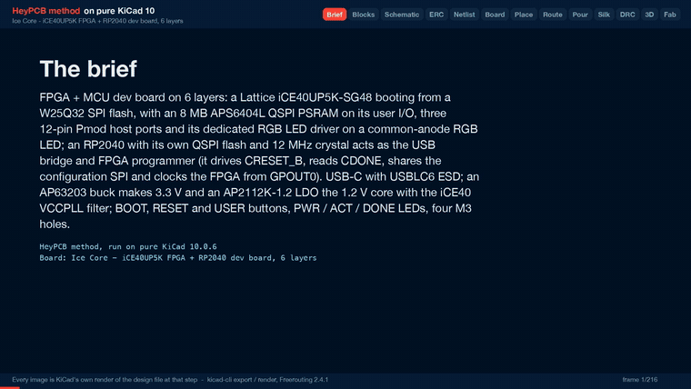

# Ice Core

A 6-layer iCE40UP5K FPGA board with 8 MB PSRAM and three Pmods, programmed and clocked over USB-C by an RP2040.

<p align="center"></p>

| Layers | Size | Parts | Nets | Connections routed | Vias | ERC errors | DRC errors / unconnected / parity |
|---|---|---|---|---|---|---|---|
| 6 | 80 x 60 mm | 78 | 73 | 234 -> 0 open | 180 | 0 | 0 / 0 / 0 |

**Not fabricated, assembled or powered.** Every number on this page is measured by KiCad 10 on the files in this folder; the full measurements are in [`report.json`](report.json).

| | |
|---|---|
| KiCad project | [`kicad/`](kicad/) |
| Gerbers, BOM, CPL, STEP, schematic PDF | [`fab/`](fab/) |
| Renders | [top](media/top.png), [bottom](media/bottom.png) |
| Design process, every step as KiCad rendered it | [`media/design-process.mp4`](media/design-process.mp4) |

<p align="center"></p>

Ice Core is an FPGA board: a Lattice iCE40UP5K with 8 MB of QSPI PSRAM and three
Pmod host ports, programmed and clocked over USB-C by an RP2040, on 80 x 60 mm of
6-layer board. It was designed with the HeyPCB method on KiCad 10 (the headless
heypcb-kicad pipeline, routed by Freerouting 2.4.1) from the brief in `board.json`.

**This board has not been fabricated, assembled or powered.** It passes ERC, the
netlist round trip, routing, DRC with schematic parity, DFM and the fab gate in
KiCad 10.0.6, headless, and nothing more. No firmware or gateware for it exists.
Every gate number below is read from `report.json`. The stackup, the vias in the
exposed pads, the pours, part positions, pad nets, via counts and spacing, the
silkscreen and each footprint's 3D model were read from `kicad/ice_core.kicad_pcb`
with KiCad 10.0.6's pcbnew.

## What it is

| | |
|---|---|
| FPGA | Lattice iCE40UP5K-SG48 (QFN-48), booting from a W25Q32JV 4 MB SPI flash in controller mode |
| FPGA memory | AP Memory APS6404L-3SQR-SN, 8 MB QSPI pseudo-SRAM (SOIC-8), on six FPGA I/O |
| MCU | Raspberry Pi RP2040 (QFN-56) with its own W25Q32JV 4 MB QSPI boot flash and the ABM8-272-T3 12 MHz crystal |
| MCU role | USB bridge and FPGA programmer: drives CRESET_B, reads CDONE, owns the configuration SPI, clocks the FPGA from GPOUT0 |
| USB | USB-C receptacle (HRO TYPE-C-31-M-12), 5.1k CC pull-downs, USBLC6-2SC6 ESD clamp, 27 ohm series terminations at the RP2040 |
| 3.3 V | Diodes AP63203WU buck from VBUS, 2 A, 3.9 uH |
| 1.2 V | AP2112K-1.2 LDO from VBUS, so the FPGA core rises before its 3.3 V banks; VCCPLL through a 100 ohm / 4.7 uF / 100 nF filter |
| I/O | three 12-pin Pmod host ports (2x6 right-angle sockets) on the FPGA, 8 signals each |
| UI | common-anode RGB LED on the iCE40's RGB driver; BOOT, RESET (RP2040) and USER (FPGA) buttons; PWR, ACT and DONE LEDs |
| Mechanical | 80 x 60 mm, 2 mm corner radius, four M3 holes (3.2 mm) |
| Stackup | 6 copper layers (below) |

### Connections that firmware and gateware need

RP2040 (pin numbers and names from the KiCad symbol, read back from the run's
netlist):

| RP2040 | pin | net | use |
|---|---|---|---|
| GPIO16 | 27 | CFG_CIPO | SPI0 RX: flash DO and the FPGA's SPI_SI |
| GPIO17 | 28 | CFG_SS | SPI0 CSn: flash /CS and the FPGA's SPI_SS_B (10k pull-up) |
| GPIO18 | 29 | CFG_SCK | SPI0 SCK (10k pull-up) |
| GPIO19 | 30 | CFG_COPI | SPI0 TX: flash DI and the FPGA's SPI_SO |
| GPIO20 | 31 | FPGA_CRESET | CRESET_B (10k pull-up) |
| GPIO21 | 32 | FPGA_CLK | GPOUT0 into the iCE40's global buffer pin 35 (IOT_46b_G0) |
| GPIO22 | 34 | FPGA_CDONE | CDONE (10k pull-up) |
| GPIO24 | 36 | LED_DONE | DONE LED (firmware mirrors CDONE) |
| GPIO25 | 37 | LED_ACT | ACT LED |
| QSPI_* | 51-56 | QSPI_* | boot flash |
| USB_DM / USB_DP | 46 / 47 | via 27 ohm | USB-C |

iCE40UP5K-SG48 (package pin numbers; every one except RGB0-2 is an `IO*` pin of
the KiCad symbol):

| function | pins |
|---|---|
| PSRAM CE#, SCLK, SIO0, SIO1, SIO2, SIO3 | 3, 4, 6, 9, 10, 11 |
| Pmod A pins 1-4 / 7-10 | 2, 47, 45, 43 / 48, 46, 44, 42 |
| Pmod B pins 1-4 / 7-10 | 25, 21, 19, 13 / 26, 23, 20, 18 |
| Pmod C pins 1-4 / 7-10 | 38, 36, 32, 28 / 37, 34, 31, 27 |
| clock in (from RP2040 GPOUT0) | 35 (G0) |
| USER button (to GND, enable the pull-up in gateware) | 12 |
| RGB0 / RGB1 / RGB2 | 39 red / 40 green / 41 blue cathode |
| configuration SPI SO / SCK / SS / SI | 14 / 15 / 16 / 17 |

The pin plan: the symbol has 36 `IO*` pins, 4 of them the configuration SPI, which
leaves 32 general I/O, and this board uses all 32. Each Pmod takes the I/O on the
side of the FPGA it faces and its missing pins from the next corner
counter-clockwise (Pmod B from the bottom of the right side, Pmod C from the right
end of the top, Pmod A from the top of the left side), so no Pmod crosses the
configuration SPI at the bottom-left corner. An earlier plan crossed it with Pmod B
and left PB8 open at pin 11. Pmod order along each connector follows the pin order
along the FPGA's edge.

Pmod pin numbers are Digilent's (Pmod Interface Specification 1.1.0, Figure 5).
On KiCad's `PinSocket_2x06_P2.54mm_Horizontal` they land as Pmod pin 1 -> pad 11,
2 -> 9, 3 -> 7, 4 -> 5, 5 (GND) -> 3, 6 (3V3) -> 1, 7 -> 12, 8 -> 10, 9 -> 8,
10 -> 6, 11 (GND) -> 4, 12 (3V3) -> 2: the footprint's square pad 1 is Pmod pin 6.

## Stackup

pcbnew reads 6 copper layers and a 1.6 mm board from the board file. The file holds
no stackup section, so this is KiCad's default 6-layer stackup, not a fab's: choose
the fab's own 6-layer stackup when ordering. pcbnew's stackup object is not
scriptable in KiCad 10.0.6, so the layer thicknesses below come from the gerber job
file (`ice_core-job.gbrjob` in `fab/ice_core_gerbers.zip`). Nothing on this board
is impedance controlled (USB runs at Full Speed).

| layer | role while routing | pour after routing | filled as | copper |
|---|---|---|---|---|
| F.Cu | signal | GND | 12 pieces | 0.035 mm |
| In1.Cu | GND plane | GND | 1 piece | 0.035 mm |
| In2.Cu | signal | GND | 2 pieces | 0.035 mm |
| In3.Cu | power plane | 3V3, zone priority 1 | 1 piece | 0.035 mm |
| In4.Cu | GND plane | GND | 1 piece | 0.035 mm |
| B.Cu | signal | GND | 1 piece | 0.035 mm |

In3.Cu is `auto` in the brief: the supply rail with at least 1.5x the pins of the
next one. In this run's netlist 3V3 has 54 pins and no other supply more than 12
(VBUS). Five FR4 dielectrics of 0.274 mm, 1.6 mm overall.

Why this plan: every routed layer sits next to a plane (F.Cu over In1, In2 between
In1 and In3, B.Cu over In4), so every signal has its return path beside it, and
In3/In4 are a tightly coupled power/ground pair. Each of the three planes fills as
one piece. The pieces are counted on the fill stored in the board file. The silk
stage removed 8 stitching vias after that fill, and refilling a copy of the board
gave the same counts on every layer. The price is routing room: Freerouting routes
on F.Cu, In2.Cu and B.Cu only, the same three layers as on a 4-layer board.

## Measured gates

One full run with media, 2026-10-01: KiCad 10.0.6 (from the DRC report),
Freerouting 2.4.1 (from its log). The Specctra export carried the brief's 0.5 mm
hole-to-hole minimum to Freerouting as a 0.3 mm `via_via` clearance
(`viaViaClearance_mm` in the report: 0.5 mm + 0.3 mm drill - 0.5 mm via).

| gate | measured |
|---|---|
| Compose | 78 parts, 73 nets, 3 no-connects (J1.A8, J1.B8, U3.4) |
| Part binding | 74 bound, 0 unsourced, 0 conflicts; H1-H4 not in the BOM; 17 Extended part numbers, $51.0 estimated JLC Extended fees |
| ERC | 0 errors, 0 warnings |
| Netlist round trip | identical, 73 nets |
| Route | 234 -> 0 open. Fanout solve kept: 0 open, DRC score 0, 101 vias. Fanout-off solve: 2 open (PSRAM_CS, U4_RP_DM), and the last mile closed neither (U4_RP_DM hit its 400,000-expansion search cap, PSRAM_CS had no path). 2 locked vias in exposed pads (U4.57, U6.49). 839 tracks, 2034.8 mm (F.Cu 1180.9, In2.Cu 644.1, B.Cu 209.8) |
| Pours | GND on F.Cu, B.Cu, In1.Cu, In4.Cu, In2.Cu; 3V3 on In3.Cu; 87 stitching vias, 0 island-repair vias; 0 open after the pours, after stitching and at the end; 188 vias after the pours |
| Silkscreen | 11 of 11 words in place of designators; 55 designators seated, 12 hidden where nothing fit; all 4 title lines placed, on the back; 8 GND stitching vias displaced under text; 90 footprint silk items clipped at the board edge (29 on each Pmod socket J2-J4, 3 on the USB-C J1) |
| DRC (fresh, schematic parity) | 0 errors, 0 unconnected, 0 parity; 4 warnings, all `lib_footprint_mismatch`, on J1-J4, the four footprints whose silk was clipped; no repairs |
| DFM (`jlcpcb_6layer`) | 0 errors, 1 warning: stock footprint silk down to 0.10 mm (292 items), printed at the fab's 0.15 mm |
| Fab | ready, no blockers; 6 copper gerbers (F, In1, In2, In3, In4, B) and a gerber job with LayerNumber 6 and a 1.6 mm board; drill, BOM, CPL (6 rotations corrected), schematic PDF, STEP |
| Media | all ran: 63 3D frames, then the raytraced renders and the design-process video (216 frames; 150.0 s at 1920 x 1080, measured with ffprobe) |

Vias, measured on the finished board: 180 in all. 101 are routed vias at 0.5/0.3 mm,
2 of them the locked vias in the exposed pads. 79 are stitching vias at 0.6/0.3 mm:
87 laid by the pour stage, less the 8 the silkscreen displaced. The closest two via
holes are 0.507 mm apart (PB10 and PB3), and no pair is under the 0.5 mm minimum.
DRC reports no `hole_to_hole` rows.

## Silkscreen

The front carries a word instead of a designator on the 11 parts a user plugs into,
presses or reads: USB, PMOD A, PMOD B, PMOD C, BOOT, RST, USER, PWR, ACT, DONE and
RGB.

The board's name is on the back: all four title lines ("Ice Core", "iCE40UP5K +
RP2040, 6 layers", "rev A  heypcb-kicad", "pure KiCad 10 + Freerouting"), placed as
one block. The brief asks for the block on the board's centre line, 22 mm from the
top edge. That spot was not free, so the block landed 9 mm left and 3 mm down, at
x 19.9-42.1 mm and y 23.5-32.9 mm from the board's top-left corner, behind the
RP2040's right side and the PSRAM. The previous full run, the one this README
described before, placed none of the four lines, because the 5 mm stitching-via
grid left no gap long enough. Text may now displace a GND stitching via. This run
displaced 8: 4 under the title and 4 under the ACT, BOOT, USER and PMOD A words.

## Files

- `board.json`: the brief the pipeline built everything here from.
- `report.json`: the run's gate report, the source of every number above.
- `kicad/`: `ice_core.kicad_pro`, `ice_core.kicad_sch`, `ice_core.kicad_pcb`
  (routed and poured) and `models/`, the two generated 3D envelopes (D1 and J1,
  below).
- `fab/ice_core_gerbers.zip`: 13 layer gerbers, the gerber job, the drill file
  and the drill map.
- `fab/ice_core_bom.csv`, `fab/ice_core_cpl_jlc.csv` (JLC placement, rotations
  corrected), `fab/ice_core_pos.csv` (KiCad placement),
  `fab/ice_core_schematic.pdf`, `fab/ice_core.step` (72 bodies; none for D1, J1
  or the mounting holes).
- `media/`: `hero.png`, `top.png`, `bottom.png` and the design-process video
  (`design-process.mp4`, `design-process.gif`).

## 3D models

KiCad 10.0.6 installs no 3D model for three of the footprints this board uses,
so the pipeline gives each a stand-in (read from each footprint's model path on
the board):

- **U6, the iCE40** (`QFN-48-1EP_7x7mm_P0.5mm_EP5.6x5.6mm`) uses the library's
  `QFN-48-1EP_7x7mm_P0.5mm_EP5.15x5.15mm.step`. It is the same 7 x 7 mm body
  with the same 48 pins. Only the exposed pad differs, and the body hides it.
  `fab/ice_core.step` carries this body.
- **D1, the RGB LED** (`LED_Avago_PLCC4_3.2x2.8mm_CW`) is a simplified envelope
  that the pipeline generates (`kicad/models/led_plcc4_3.2x2.8.wrl`): a white
  3.2 x 2.8 mm body with a clear lens and a dark mark at the pad-1 corner. Its
  1.9 mm height is an assumption. It is not the TuoZhan part's model.
- **J1, the USB-C receptacle** is also a generated envelope
  (`kicad/models/usb_c_hro_type-c-31-m-12.wrl`).

Both envelopes are VRML files. They show in the renders, but `fab/ice_core.step`
has no body for D1 or J1.

## Parts that are not what the request named

- **iCE40UP5K-SG48I (LCSC C2678152), the tray part**, on KiCad's
  `FPGA_Lattice:ICE40UP5K-SG48ITR` symbol (tape and reel): same die, same QFN-48.
  LCSC stocks only the tray part.
- **W25Q32JVSSIQ (C179173) as the RP2040's boot flash**, where Raspberry Pi's
  minimal design uses a W25Q128JVS. The RP2040's `boot2_w25q080` second stage
  drives any W25Q part in quad-I/O mode; this one holds 4 MB. It is the same
  part as the FPGA's configuration flash.
- **RGB LED: TuoZhan S4-3528RGBTA-A (C2827321)** on KiCad's
  `LED_Avago_PLCC4_3.2x2.8mm_CW` footprint with the `Device:LED_BGRA` symbol.
  KiCad's Broadcom ASMB-MTB0/MTB1 symbols carry their own footprint, but LCSC
  lists neither part. The part's data sheet numbers its pins 1 blue cathode,
  2 anode, 3 green cathode, 4 red cathode. With its pin 1 on pad 1, the footprint's
  pads 1-4 carry blue, green and red cathode and the anode (on the board: LED_B,
  LED_G, LED_R, 3V3), which is `Device:LED_BGRA`. The part's own pins 2-4 are not
  the pad numbers.
- **10k resistors: FRC0603F1002TS (C2906982, Extended)** instead of the Basic
  C25804 the pinned table offers: that one had 0 stock and is no longer in the
  live catalogue (2026-09-30).

Part numbers come from heypcb-kicad's pinned LCSC table. Of the 28 distinct LCSC
numbers in `fab/ice_core_bom.csv`, 14 carry a live lookup dated 2026-09-30 and 14
older snapshots (2026-06-23 to 2026-07-03), so check stock when ordering. The
APS6404L-3SQR-SN (C5333729) had 41 in stock at its lookup.

## Check before ordering

1. **It has never been built.** Order one panel, assemble one board, and bring
   it up rail by rail (VBUS, 3.3 V, 1.2 V) before trusting anything else.
2. **Stackup.** The board file states none, so the gerber job carries KiCad's
   default. Replace it with the fab's 6-layer stackup.
3. **Vias in the exposed pads.** One locked 0.5/0.3 mm GND via sits at the centre
   of each exposed pad: the RP2040's (U4.57, 3.2 x 3.2 mm) and the iCE40's
   (U6.49, 5.6 x 5.6 mm). The board asks for no filling and no capping. On top
   each via lies inside the pad's solder-mask opening, an open hole, and the
   paste windows (4 on U4, 16 on U6) leave it uncovered. Ask for filled and capped
   vias, or expect solder to wick into them.
4. **RGB LED orientation and land pattern.** The S4-3528RGBTA-A's recommended
   pads (1.8 x 0.8 mm, 1.6 mm apart, from its data sheet) lie only roughly inside
   the Avago footprint's (1.5 x 1.1 mm at 3.0 x 1.5 mm pitch, measured on D1).
   Check pin 1 and the paste in the assembler's preview.
5. **VCCPLL filter.** The 100 nF (C27) sits at pin 29: its VCCPLL pad centre is
   1.84 mm from the pin's. The 100 ohm (R8) and the 4.7 uF (C26) sit below-right of the
   FPGA, at (57.25, 38.50) mm and (60.50, 39.00) mm from the board's top-left,
   8.6 and 10.9 mm from pin 29, out of Pmod C's escape. U6_VCCPLL runs 15.8 mm
   of track (F.Cu 7.0, In2.Cu 8.8) through 2 vias. Move them closer if you can
   route it.
6. **VPP_2V5 runs from 3.3 V** (pin 24 is on the 3V3 net). Fine for booting from
   flash and for the RGB driver; never program the iCE40's NVCM from this rail.
7. **Firmware has to do the board's job**: start GPOUT0 (the FPGA's only clock),
   hold CRESET_B low while it writes the configuration flash, then release the
   SPI pins (tri-state) before releasing CRESET_B, since the FPGA reads the same
   flash as an SPI controller.
8. **Extended parts**: 17 Extended part numbers, about $51 in JLC's per-part
   Extended fees at the report's estimate.

## Reproduce

From the heypcb-kicad repository:

```bash
./run.sh --board boards/ice_core              # with the 3D renders and the video
./run.sh --board boards/ice_core --no-media   # the gates only
```

Placement walks parts in reference order and the Specctra file is written in a
content-only order, so the brief is meant to route the same way every time. This
README reports one run. The previous full run, made before the silkscreen and
3D-model changes, reported the same route: 234 -> 0 open, 101 vias, 839 tracks and
2034.8 mm. An earlier run without media also gave 234 -> 0 open with 101 vias. The
boards were not compared track by track.
