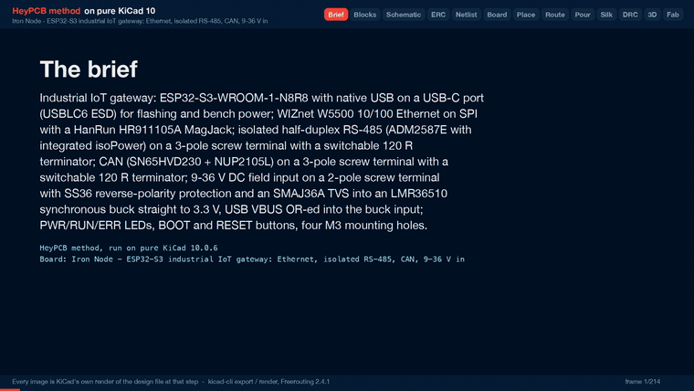

# Iron Node

An ESP32-S3 industrial gateway with Ethernet, isolated RS-485, CAN and a 9-36 V input.

| Layers | Size | Parts | Nets | Connections routed | Vias | ERC errors | DRC errors / unconnected / parity |
|---|---|---|---|---|---|---|---|
| 4 | 90 x 66 mm | 83 | 57 | 215 -> 0 open | 135 | 0 | 0 / 0 / 0 |

**Not fabricated, assembled or powered.** Every number on this page is measured by KiCad 10 on the files in this folder; the full measurements are in [`report.json`](report.json).

| | |
|---|---|
| KiCad project | [`kicad/`](kicad/) |
| Gerbers, BOM, CPL, STEP, schematic PDF | [`fab/`](fab/) |
| Renders | [top](media/top.png), [bottom](media/bottom.png) |
| Design process, every step as KiCad rendered it | [`media/design-process.mp4`](media/design-process.mp4) |

An industrial IoT gateway: an ESP32-S3 with wired Ethernet, isolated RS-485 and CAN, powered
from a 9-36 V DC field supply or from USB-C. It was designed with the HeyPCB method on KiCad 10
(10.0.6), by heypcb-kicad's headless pipeline with Freerouting 2.4.1, from the brief in
`board.json`.

**This board has not been fabricated, assembled or powered.** Everything below is what KiCad and
the pipeline measured on the design files. Nothing here has been tested on hardware, and
nothing here contains or tests firmware.

## Specs

- **MCU:** ESP32-S3-WROOM-1-N8R8, with native USB on a USB-C port and USBLC6-2SC6 ESD
  protection. The antenna end of the module hangs 6.05 mm past the top edge (*read off the
  board*, from its F.Fab outline).
- **Ethernet:** WIZnet W5500 (LQFP-48, C32843) on SPI, with a 25 MHz crystal. It drives a HanRun
  HR911105A RJ45 MagJack (integrated 1:1 magnetics, link and activity LEDs). The circuit follows
  WIZnet's W5500-Ref-RJ45WithMag reference schematic.
- **RS-485, isolated:** ADM2587E (Analog Devices), an isolated RS-485 transceiver with its own
  isoPower DC/DC. It runs half duplex with DE/~RE on one GPIO and a pull-down. A slide switch
  fits a 120 R terminator. The bus is on a 3-pole screw terminal: A, B, isolated GND. The
  isolated side of the ADM2587E, its isoPower capacitors, the terminator, its switch and the
  terminal sit in their own corner of the board, behind a copper keep-out barrier (see
  *The isolation barrier* below).
- **CAN:** SN65HVD230 (3.3 V) with an NUP2105L bus protector. A slide switch fits a 120 R
  terminator. The bus is on a 3-pole screw terminal: CANH, CANL, GND.
- **Power:** 9-36 V DC on a 2-pole screw terminal. It goes through an SS36 series Schottky
  (reverse polarity) and an SMAJ36A TVS into an LMR36510 (TI, 4.2-65 V in, 1 A, 400 kHz,
  synchronous) that makes 3.3 V directly. USB VBUS joins the buck input through a second
  SS36, so the board also runs and flashes from USB alone. No LDO is needed: every chip on
  the board runs from 3.3 V.
- **UI:** BOOT (IO0) and RESET (EN) buttons below the module. PWR (red), RUN (orange, IO14) and
  ERR (red, IO21) LEDs, plus the jack's own link and activity LEDs.
- **Board:** 90 x 66 mm, 4 copper layers, 1.6 mm. F.Cu is signal with a GND pour, In1 a GND
  plane, In2 signal with a 3V3 pour, B.Cu signal with a GND pour, except in the isolated
  bottom-right corner, which has no pour on any layer. Four non-plated 3.2 mm holes for M3
  screws sit 4.5 mm in from the corners. USB-C is on the left edge, the RJ45 on the right edge,
  and every field terminal on the bottom edge.

### ESP32-S3 pin map

| Function | GPIO | Module pin |
|---|---|---|
| W5500 SCLK / MOSI / MISO / CS | IO41 / IO40 / IO39 / IO42 | 34 / 33 / 32 / 35 |
| W5500 INTn / RSTn | IO38 / IO2 | 31 / 38 |
| CAN TX / RX (TWAI) | IO9 / IO10 | 17 / 18 |
| RS-485 TX / RX / DE+~RE | IO11 / IO12 / IO13 | 19 / 20 / 21 |
| RUN / ERR LED | IO14 / IO21 | 22 / 23 |
| BOOT | IO0 | 27 |
| USB D- / D+ | IO19 / IO20 | 13 / 14 |

The SPI pins go through the GPIO matrix rather than the FSPI IOMUX pins, because the module's
right-side pins face the W5500. IO39-IO42 are the JTAG pins, so JTAG debugging has to go over
USB (the S3's built-in USB-JTAG). The strapping pins IO0, IO3, IO45 and IO46 carry nothing
except BOOT.

### Chip substitutions

The brief allowed swaps where a chip lacks a KiCad 10 symbol or stock. These were made:

| Asked for | Fitted | Why |
|---|---|---|
| TI ISO1410 + an isolated DC/DC (or an ISOW part) | **ADI ADM2587E** (ADM2587EBRWZ-REEL7, C12081) | The installed KiCad 10 library has no ISO1410 and no ISOW14xx symbol. TI's ISO3082/ISO3088 have symbols, but the 2026-09-30 JLC lookup found no stock for them. The ADM2587E has a stock symbol and footprint, its own isolated DC/DC, and had 5711 in stock on that date |
| TCAN1044 or SN65HVD230 | **SN65HVD230DR** (C12084) | The library has no TCAN1044 symbol, only the 14-pin TCAN1043 |
| a stocked TI/MPS synchronous buck to 5 V or 3.3 V, plus an LDO/buck to 3.3 V as needed | **LMR36510ADDAR** (C1858393) to 3.3 V, no second stage | A 65 V synchronous buck in the library with JLC stock. With USB OR-ed into its input, a single 3.3 V rail serves every chip |
| RJ45 MagJack with integrated magnetics, JLC-stocked, with a KiCad 10 footprint | **HanRun HR911105A** (C12074) | It has a stock KiCad symbol and footprint |

## The isolation barrier

The pour stage floods the whole outline: GND on F.Cu, In1 and B.Cu, 3V3 on In2. Until this build,
those pours ran under the ADM2587E, between its logic-side and isolated-side pin rows, on all four
layers. On the previous build the isolated copper came within 0.250 mm of them on every layer
(*read off* that board), and the isolated nets also ran on In2, inside the 3V3 pour. The barrier is now built from the brief's `board.keepouts`, which become KiCad
rule areas at the board stage. Coordinates are in mm from the board's top-left corner.

- **The barrier strip** (`iso_barrier_under_u6`, x 56.5-90, y 40.5-47.5) bans pours, tracks and
  vias on all four layers. It lies between the ADM2587E's two pad rows and runs to the right edge.
  The rows' pad edges are at y 40.375 and 47.625, a 7.25 mm land gap (*read off the board*). The
  strip is 7.0 mm wide and leaves 0.125 mm to each row.
- **The barrier's leg** (`iso_barrier_down`, x 56.5-63.5, y 40.5-66) has the same bans. It runs
  from the strip down to the bottom edge, between the CAN and RS-485 terminals. With the board
  edges, the strip and the leg close off the bottom-right corner.
- **The isolated region** (`iso_region_no_pour`, x 63.5-90, y 47.5-66, 26.5 x 18.5 mm) bans pours
  only. No GND or 3V3 pour enters it on any layer, and the isolated nets route there as tracks.
  The rule area is withheld from Freerouting. No stitching via lands there either, because a
  stitching via needs GND fill on every GND layer.
- **Placement.** The ADM2587E, its three isolated-side capacitors (C32-C34), the 120 R terminator
  (R18), its switch (SW2) and the terminal (J5) are locked into the region. The barrier and the
  region are placement reserves, so the placer keeps every other part out of them.
- **Net class.** The isolated nets (ISO_GND, ISO_3V3, RS485_A, RS485_B, RS485_TERM) form the ISO
  class, with 0.5 mm clearance between each other and 0.2 mm tracks.

*Read off the board* with KiCad 10.0.6's `pcbnew` on the final `kicad/iron_node.kicad_pcb`. This
is the minimum edge-to-edge distance between copper of an isolated net and copper of any other
net: pads, plated hole walls, tracks, vias and pour fills. Two methods were used (exact segment
distances, and a bisection on inflated polygons), and they agree.

| Layer | Isolated copper to other copper | Where |
|---|---|---|
| F.Cu | **7.125 mm** | ISO_GND pad U6.11 to the GND pour that fills from GND pad U6.10 down to the strip's edge |
| In1.Cu | 8.371 mm | an ISO_GND via at (65.17, 49.59) to the GND plane at the leg's edge |
| In2.Cu | 8.371 mm | the same via to the 3V3 pour at the leg's edge |
| B.Cu | 8.371 mm | the same via to the GND pour at the leg's edge |
| any layer to any layer, in plan view | **7.125 mm** | the same F.Cu pair; no copper overlaps across layers |

- The unnetted copper inside the region does not lower the number when it is counted with the
  isolated side. That copper is the PCM12's shell pads and its unused throw.
- Every isolated track and via lies inside the region, and no other net's track or via ends in the
  region or the barrier. The isolated nets have 142.0 mm of track (F.Cu 96.5, In2 45.4, none on
  B.Cu) and 6 vias. ISO_GND is routed as tracks: 46.1 mm, 4 vias.
- At the package, no copper keep-out can beat the footprint's 7.25 mm land gap; only a slot
  could. The strip stops 0.125 mm short of each pad row, which is where 7.125 mm comes from.
  This board has no slot.
- **Clearance is not a rating.** The ADM2587E's 2.5 kV rms is a rating of the part. The board
  provides the distances above. The board has no slot, so on each outer face the shortest surface
  path across the barrier is the straight line measured on that face. Whether 7.125 mm is enough
  depends on the working voltage, the pollution degree, the material group and the standard the
  product is assessed to. None of that was assessed here.

## What it measured

A full run with media on 2026-10-01 (KiCad 10.0.6, Freerouting 2.4.1). Gate numbers are from
`report.json`. Anything marked *read off the board* was measured on `kicad/iron_node.kicad_pcb`
with KiCad 10.0.6's `pcbnew` Python module. That file's SHA-256 is the board hash DRC recorded.

| Gate | Result |
|---|---|
| Composition | 83 parts, 57 nets, 43 no-connects (16 block instances of 11 distinct blocks, 5 of them new `iron_*` blocks) |
| Part binding | 79 of 83 parts bound to an LCSC number, 0 unsourced, 0 identity conflicts. H1-H4, the mounting holes, are not BOM parts. 19 distinct Extended parts, about $57 in JLC loading fees. 3 warnings: R5, R15 and R17 use the 10k 0603 C25804, which had 0 stock at its 2026-06-23 snapshot |
| ERC (`kicad-cli sch erc --severity-all`) | 0 errors, 0 warnings |
| Netlist round trip | identical, 57 nets |
| Routing, rung 1, fanout on | Freerouting left 1 of 215 connections open (VBUS, J2.A9 to C9.1). The last-mile router closed it (3 tracks, 1 via, 0.08 s), and DRC accepted it with no new error. 23.6 s, 70 vias. **This solve is kept** |
| Routing, rung 1, fanout off | Freerouting left 2 open. The last mile closed VBUS and found no path for ISO_GND (U6.16 to C32.2), so 1 stayed open. 23.0 s, 70 vias |
| Net classes | No class was narrowed. Every track is at its class width (*read off the board*): PWR 98.4 mm at 0.5 mm, ISO 142.0 mm at 0.2 mm, everything else 1667.7 mm at 0.2 mm |
| Copper | 730 tracks, 1908.0 mm (F.Cu 1058.5, In2 766.2, B.Cu 83.3), 70 routing vias |
| Pours (laid only after a measured 0 open) | GND on F.Cu, In1 and B.Cu, 3V3 on In2, kept out of the barrier and the isolated region. Then 72 stitching vias, 142 vias in total. 0 open after the pours and after stitching, 0 island-repair vias |
| Silkscreen | 16 words placed (see *Silkscreen labels* below), 47 designators seated and 24 hidden, all 5 back-side title lines placed. The text displaced 7 stitching vias, which leaves 135 vias on the board (*read off the board*, all 0.6/0.3 mm). 22 footprint silk strokes that left the board or came within 0.3 mm of its edge were dropped |
| DRC (`kicad-cli pcb drc --severity-all --schematic-parity`) | fresh (its board hash matches the final `.kicad_pcb`), 0 errors, 0 unconnected, 0 parity issues, 5 warnings |
| DFM (`jlcpcb_4layer` profile) | 0 errors, 1 warning: 255 stock-footprint silk strokes at 0.12 mm, which the fab prints at its 0.15 mm minimum |
| Fab gate | ready, no blockers. 4 copper gerbers and a gerber job with LayerNumber 4, 1.6 mm. The JLC CPL corrected 5 rotations |
| 3D, renders, video | all ran: 63 3D frames, then the renders (171.1 s) and the design-process video (214 frames, 146.4 s at 1920 x 1080, measured with ffprobe) |

- **The 5 DRC warnings** are all `lib_footprint_mismatch`: J1, J4 and J5 (the screw terminals),
  J2 (USB-C) and U3 (the module). These are the five footprints that lost silk strokes at the
  board edge (*read off the board* against the library: 5 each on J1, J4 and J5, 4 on U3, 3 on
  J2). J1-J5 also carry a generated 3D body from `kicad/models/`. J3 carries one too and is not
  flagged, so the flag follows the dropped strokes.
- The project's DRC settings ignore five checks: missing courtyard, track not centred on via,
  tuning-profile track geometry, footprint filters mismatch and footprint type mismatch.

### Why the brief looks the way it does

These were measured on runs from 2026-09-30 to 2026-10-01. The reasons are also recorded in
`board.json`.

- **Screw terminals are locked, not edge-placed.** The placer's edge rung tests which side of a
  connector is its mouth. It picked the back of the MX126 terminals, because their pins sit
  mid-body (4.0 mm to the back face, 3.8 mm to the front). They are locked at rot 0 with the pins
  3.8 mm in from the bottom edge. KiCad's footprint generator draws the wire entry on local +y.
  This was checked against the Phoenix MKDS footprint, which has the same drawing and a 3D model.
- **The ISO class has 0.5 mm clearance and 0.2 mm tracks.** Its clearance used to be held at the
  board's 0.2 mm, because a GND stitching via landed 0.35 mm from an ISO_GND track. Now the
  stitcher and the pours stay out of the isolated region, so the class takes its own clearance.
  0.5 mm is the most the region's footprints allow: the ADM2587E's pads are 0.67 mm apart, and the
  PCM12's B throw is 0.55 mm from its own mounting pad. At 0.3 mm tracks, all four rung-1 solves
  over two runs left one isolated connection open: ISO_GND U6.16-C32.2 or RS485_B U6.15-J5.2. The
  ladder's narrowing to 0.2 mm then routed them all. The bus and the isoPower supply carry tens of
  mA.
- **In2 is a routing layer, not a GND plane.** A plane layer goes to Freerouting as a power
  layer. A run with In2 named a GND plane routed on F.Cu and B.Cu only and left ISO_GND open. In2
  routes, then takes the 3V3 pour.
- **3V3 has no net class of its own.** In four earlier runs with a 0.3 mm 3V3 class, the routing
  ladder had to narrow it to 0.2 mm every time. 3V3 now routes at 0.2 mm (237.0 mm of track,
  *read off the board*), and the In2 3V3 pour carries its current.
- **The buttons sit below the module.** A silk word may not overlap any courtyard. The module's
  courtyard box covers x -2 to 46 down to y 20.25, and the USB-C receptacle's starts at y 21.64.
  At their old spots (BOOT at (37, 16), RESET at (6, 14.5), then at (6, 18.5)), neither a word nor
  a designator fit. BOOT is now at (37, 19.5), with its word below it, and RESET at (29, 30), with
  its word beside it.
- **J1's + and - are switch words.** `silk.polarity` puts its mark 1.9-2.3 mm from the pad centre,
  which is inside a 2.8 mm terminal pad's own clearance. So it never placed J1's marks. The brief
  instead gives J1 a `silk.switches` entry keyed on each pin's net. That places "+" above pin 1
  (VIN_RAW) and "-" above pin 2 (GND), just beyond the terminal's courtyard.

## Check before ordering

The board passes ERC, DRC with schematic parity, DFM and the fab gate in KiCad. **It has not been
fabricated, assembled or powered.**

- **The RS-485 isolation is measured, not rated.** The barrier above gives 7.125 mm on F.Cu, at
  the ADM2587E's own pad rows, and 8.371 mm on the other layers. Check those distances against the
  working voltage and the standard the product must meet. To gain more at the package, cut a slot
  in the barrier strip between the pad rows (not done here).
- **The bottom-right M3 hole (H4) is inside the isolated region.** It is non-plated, with no net.
  Its hole edge is 4.34 mm from the nearest isolated copper (SW2's B throw) and 2.77 mm from
  SW2's unnetted shell pad (*read off the board*). A metal screw or standoff there is a conductor
  in the isolated region. Use a nylon screw, or check its head and standoff against the isolated
  copper and the enclosure.
- **The isolated region has no ground pour.** ISO_GND is a 0.2 mm track (46.1 mm on F.Cu and In2,
  4 vias). The brief has no key for a pour of one net inside one region (`board.pours` takes a
  whole inner layer). If EMC or surge testing asks for an ISO_GND plane, add it in KiCad.
- **Power traces run on In2.** *Read off the board:* VIN_RAW, VIN, VBUS and BUCK_SW are 0.5 mm
  along their whole length. VIN (25.3 mm) and BUCK_SW (8.9 mm) are on F.Cu. VBUS is 44.9 mm with
  4 vias, 25.3 mm of it on In2. VIN_RAW is 19.3 mm with 1 via, 17.3 mm of it on In2. The gerber
  job states 0.035 mm copper on every layer, which is KiCad's default stackup, not a fab quote.
  Confirm the inner-layer copper weight with the fab against the input and VBUS current (the buck
  is a 1 A part), or move those two nets to an outer layer.
- **Screw-terminal orientation.** The MX126 wire entry is taken to be on the footprint's +y side.
  That is KiCad's generator convention, checked on the Phoenix MKDS model. KiCad 10.0.6 installs
  no MaiXu model. The bodies in `kicad/models/` are generated from the footprint outline, with the
  openings on +y and a 10 mm height envelope, so the renders show the assumption, not a check.
  Confirm against MaiXu's drawing that the openings face out of the bottom edge.
- **Running from USB alone.** VIN is VBUS minus an SS36 drop, about 4.5 V, against the LMR36510's
  4.2 V minimum. That is enough to flash and run the MCU, but run the RS-485 isoPower at full load
  and Wi-Fi from the field supply. A default USB port gives only 500 mA.
- **3.3 V setpoint.** RFBT/RFBB are 47k/20k (both Basic parts), so VOUT = 1.0 V x (1 + 47/20) =
  3.35 V nominal, against TI's 100k/43.2k for 3.3 V. Every chip on the rail is specified to 3.6 V.
- **No input fuse.** Reverse polarity is a series SS36, and surge is an SMAJ36A after it. A
  sustained overvoltage above the TVS rating will short the TVS. Add a fuse or PTC for a field
  installation.
- **Crystal load.** The JLC mirror lists the X322525MOB4SI (C9006) as a 12 pF load part. The
  18 pF caps follow WIZnet's reference. Measure the 25 MHz error on a first article and trim the
  caps if needed (Ethernet allows +/-50 ppm).
- **Ethernet layout.** Freerouting routed the MDI lines with no impedance control or length
  matching. *Read off the board*, as track per net with the stubs to the terminations included:
  ETH_TXP is 14.9 mm and ETH_TXN 13.2 mm, with one via each. On the receive side, through the
  6.8 nF coupling caps, RD+ is 24.5 mm with 4 vias and RD- is 27.5 mm with 1 via. WIZnet's
  optional VDD/AVDD ferrite and 33 R damping resistors are not fitted. The W5500 has no Auto-MDIX.
- **USB.** *Read off the board:* D+ is 34.1 mm and D- 30.2 mm, both on F.Cu with no via. Both are
  0.2 mm with no impedance control. That is fine for the S3's Full Speed USB.
- **Part numbers.** The rows this board added were read live from jlcsearch on 2026-09-30 and
  pinned with that date. Stock and Basic/Extended class go stale, so re-check before ordering. On
  that date LMR36510ADDAR had 1663 in stock and ADM2587EBRWZ-REEL7 had 5711. R5, R15 and R17
  bind to the 10k 0603 C25804, which had 0 stock at its 2026-06-23 snapshot, so pick a stocked
  10k.
- **Grounds.** The M3 holes are non-plated with no net (*read off the board*), so the enclosure is
  not bonded to any ground. The RJ45 shield reaches GND only through 1 nF / 2 kV. CAN is not
  isolated: its terminal GND is the board GND.
- **Debug.** IO39-IO42 carry the W5500's SPI, so JTAG is available over USB only.
- **Silkscreen labels.** *Read off the board:* the front carries USB, ETH, 9-36V, CAN, RS-485,
  PWR, RUN, ERR, BOOT and RST. A "+" sits above J1's pin 1 and a "-" above its pin 2. Each
  termination switch has a 120R and an OFF word, each level with the throw it names. The CAN and
  RS-485 terminals have no per-pin marks on the front. Their pinouts are on the back ("CAN: 1 H 2
  L 3 GND  RS-485: 1 A 2 B 3 GISO"), with "IN: 1 +9..36V 2 GND", "ESP32-S3 / W5500 / iso RS-485 /
  CAN" and "rev A heypcb-kicad NOT FABRICATED" under the "Iron Node" title. 24 designators found
  no free spot and are hidden.
- **Termination switch labels.** SW2 (RS-485) is turned with its slider toward the right edge. Its
  120R sits left of throw 1 (B), and its OFF sits left of throw 3. SW1 (CAN) has 120R below
  throw 1 (CAN_L) and OFF above throw 3, each in line with its throw. Both labels assume that the
  PCM12 joins its common pin to the throw on the side the slider is pushed toward. Check that
  against C&K's drawing.

## Files

- `board.json`: the brief. It lists the blocks, net classes, keep-outs, placement targets, routing
  and silk settings, each with its reason.
- `report.json`: the run's gate report. Every gate number above comes from it.
- `kicad/`: `iron_node.kicad_pro`, `iron_node.kicad_sch` and the routed, poured
  `iron_node.kicad_pcb`. `kicad/models/` holds generated simplified bodies for the USB-C
  receptacle, the RJ45 and the 2- and 3-pole MX126 terminals. They are VRML envelopes, not vendor
  models.
- `fab/iron_node_gerbers.zip`: 11 gerbers (4 of them copper), the gerber job, the drill file
  and the drill map.
- `fab/iron_node_bom.csv`: the BOM, with MPN and LCSC columns.
- `fab/iron_node_cpl_jlc.csv` and `fab/iron_node_pos.csv`: the JLC CPL and KiCad's position file.
  Each lists 75 parts. The through-hole J1, J3, J4 and J5 are not in them.
- `fab/iron_node_schematic.pdf`: the schematic.
- `fab/iron_node.step`: the 3D model. It has no body for J1-J5, because their generated bodies are
  VRML, which the STEP export did not include.
- `media/`: `hero.png`, `top.png` and `bottom.png` are KiCad renders, and
  `design-process.mp4` and `design-process.gif` show the pipeline's stages. The USB-C, RJ45 and
  terminal bodies in the renders are the generated envelopes.

In the heypcb-kicad repository, `./run.sh --board boards/iron_node` regenerates these outputs
from `board.json`. The
five blocks written for this board (`iron_power_lmr36510`, `iron_w5500_ethernet`,
`iron_rs485_adm2587e`, `iron_can_sn65hvd230` and `iron_mounting_hole_m3`) give, in their notes,
the symbol pinout each was wired from and the data sheet or reference design its values came from.
