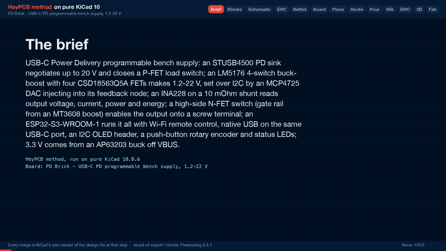

# PD Brick

A USB-C Power Delivery bench supply: STUSB4500 sink, LM5176 buck-boost, 1.2-22 V set over I2C by an ESP32-S3.

<p align="center"></p>

| Layers | Size | Parts | Nets | Connections routed | Vias | ERC errors | DRC errors / unconnected / parity |
|---|---|---|---|---|---|---|---|
| 4 | 100 x 80 mm | 120 | 71 | 283 -> 0 open | 208 | 0 | 0 / 0 / 0 |

**Not fabricated, assembled or powered.** Every number on this page is measured by KiCad 10 on the files in this folder; the full measurements are in [`report.json`](report.json).

| | |
|---|---|
| KiCad project | [`kicad/`](kicad/) |
| Gerbers, BOM, CPL, STEP, schematic PDF | [`fab/`](fab/) |
| Renders | [top](media/top.png), [bottom](media/bottom.png) |
| Design process, every step as KiCad rendered it | [`media/design-process.mp4`](media/design-process.mp4) |

<p align="center"></p>

PD Brick is a USB-C Power Delivery programmable bench supply with a 1.2-22 V output. It was designed with the HeyPCB method on KiCad 10. A headless pipeline (KiCad 10.0.6, Freerouting 2.4.1) took the brief in `board.json` through schematic, placement, routing, pours, DRC and fab outputs.

**This board has not been fabricated, assembled or powered. There is no firmware.** On the final run it passes these checks:

- ERC and the netlist round trip;
- routing at 0 open;
- DRC with 0 errors, 0 unconnected and 0 schematic-parity rows;
- DFM with 0 errors.

The fab gate is ready. Everything under "Check before ordering" is a datasheet calculation or a layout measurement, not a bench result.

## What it is

- **Input:** USB-C, USB PD 3.0 sink up to 20 V (ST STUSB4500). The controller closes an AOD4185 P-FET between the receptacle and the power stage. There is a 24 V TVS on the receptacle.
- **Converter:** TI LM5176 4-switch buck-boost at about 390 kHz, with:
  - four TI CSD18563Q5A 60 V FETs;
  - a Coilcraft XAL7070 4.7 uH / 15.2 A inductor;
  - a 10 mOhm low-side current-sense resistor;
  - 220 uF + 4 x 10 uF on each side.

  The output is about 1.2-22 V.
- **Setpoint:** a Microchip MCP4725 12-bit I2C DAC injects into the LM5176 feedback node through 15k. A higher code gives a lower voltage.
- **Monitor:** a TI INA228 (20-bit V / I / power / energy) on a 10 mOhm high-side output shunt. It shares the LM5176's average-current-limit filter on the same shunt (50 mV, about 5 A).
- **Output enable:** one CSD18563Q5A high-side N-FET. Its gate is pulled up from a 25.6 V rail made by an MT3608 boost, Vgs is clamped at 12 V, and a 2N7002 pulls the gate down. The output is off from reset.
- **Output:** Phoenix MKDS 1,5/2-5,08 screw terminal (17.5 A), with an SMBJ24A TVS and 1 uF across it.
- **MCU:** ESP32-S3-WROOM-1-N8R8, from the HeyPCB block `esp32_s3_minimal`:
  - Wi-Fi for remote control;
  - native USB on the same USB-C port (USBLC6-2SC6 on D+/D-, referenced to 3V3);
  - BOOT and RESET buttons.
- **3.3 V:** Diodes AP63203 buck from VBUS (3.8-32 V in). An LDO would burn up to 8 W from a 20 V contract.
- **UI:**
  - a 1x4 0.1" header for a 1.3" I2C OLED (GND, VCC, SCL, SDA), with the bus pull-ups;
  - an Alps EC11E push-button encoder;
  - PWR, PD and OUT LEDs.
- **Board:** 100 x 80 mm, four M3 holes, 4 layers:
  - F.Cu;
  - In1, a GND plane;
  - In2, routing with a 3V3 pour;
  - B.Cu.

### Chip substitutions

| Asked for | Fitted | Why |
|---|---|---|
| TPS55289 (or similar) I2C buck-boost | LM5176 controller + 4 x CSD18563Q5A + MCP4725 DAC | KiCad 10 has no TPS55289 (or TPS552xx) symbol, and the live JLC lookup returned no TPS55289 row. The LM5176 (`Regulator_Switching:LM5176PWP`, LCSC C442493) has no I2C, so the DAC programs its FB node. |
| STUSB4500, AP33772 or CH224K | STUSB4500 | All three have KiCad 10 symbols. The AP33772 returned no JLC row. The CH224K is pin-strapped, with no I2C. The STUSB4500 (C2678061) renegotiates over I2C at 0x28. |
| INA228 (or INA226) | INA228 | `Sensor_Energy:INA228`, C2887910. |
| Load switch or MOSFET | one CSD18563Q5A high-side N-FET + MT3608 gate rail | No KiCad 10 load switch covers 1-22 V at several amps. A P-FET cannot turn on at a 1 V output. A low-side switch is bypassed by any second ground (a scope, or a USB-powered load). |
| (VBUS switch for VBUS_EN_SNK) | AOD4185 on the generic `Transistor_FET:Q_PMOS_GDS` symbol | KiCad 10 has no AOD4185 symbol. Q_PMOS_GDS (1 G, 2 D, 3 S) is this part's TO-252 land (tab = drain). |
| (power FETs) | CSD18563Q5A, 5 x 6 mm | The 3.3 x 3.3 mm CSD18543Q3A was tried first. Its KiCad VSON land puts the gate pad 0.14 mm from a source pad, so DRC fails at 0.2 mm on the footprint itself. |

### How it is wired

```
USB-C -VBUS-> AOD4185 (STUSB4500 VBUS_EN_SNK) -VIN-> LM5176 buck-boost -VOUT-> 10 mOhm shunt -VOUT_SH-> N-FET -OUT_P-> terminal
   |                                                ^ FB <- 15k <- MCP4725 (I2C)   |  ISNS 100R/100R/1uF -> LM5176 + INA228
   +-VBUS-> AP63203 -3V3-> ESP32-S3, STUSB4500 I2C side, INA228, DAC, OLED, encoder          gate <- 1M <- 25.6 V (MT3608 off VIN)
```

- **Setting the output.** FB has 100k from VOUT and 4.7k to GND, and the DAC drives FB through 15k:

  VOUT = 0.8 V x (1 + 100/4.7 + 100/15) - VDAC x 100/15

  That is about 23.2 V at code 0 and 1.2 V at full scale. Firmware clamps the code to 1.2-22 V.
- **Order at power-up.**
  1. The STUSB4500 closes the VBUS switch at attach.
  2. The LM5176 stays off: EN has a 100k pull-down.
  3. The output stays off: OUT_OFF has a 22k pull-up.
  4. Firmware writes the DAC, sets BB_EN high, then pulls OUT_OFF low.
- **Wide power nets.** No 1.2 mm power track lands on an IC pin. On the routed board, the seven power-path nets reach only FETs, the inductor, passives, the TVS, the zener and the terminal. Every IC pin on a power net hangs off it through a resistor, placed at the power node (an `at` target in the brief):
  - LM5176 VIN, VISNS, VOSNS, SW1/SW2, CS/CSG and ISNS;
  - STUSB4500 VDD;
  - INA228 VBUS;
  - MT3608 IN.
- **I2C** (IO38 SDA, IO39 SCL, 4.7k pull-ups):
  - STUSB4500 at 0x28;
  - INA228 at 0x40;
  - MCP4725 at 0x60;
  - the OLED module at its own address.
- **ESP32-S3 pins.** All GPIOs are on the module's right column and bottom row, which face the board:

  | Pin | Function |
  |---|---|
  | IO42 / IO41 / IO40 | encoder A / B / switch |
  | IO1 / IO2 | PD / OUT LEDs |
  | IO10 | PD_RST |
  | IO11 | PD_ALERT |
  | IO12 | BB_EN |
  | IO14 | OUT_OFF |
  | IO19 / IO20 | USB D- / D+ |
  | IO0 | BOOT |

  The LM5176 PGOOD, the INA228 ALERT and a VIN divider were cut to shorten routing; the INA228 and STUSB4500 report the same information over I2C.

## Measured (full run of 2026-10-01)

Gate numbers come from `report.json`. Rows marked "on the board" were measured on `kicad/pd_brick.kicad_pcb` with KiCad's Python (`pcbnew`, read-only scripts). Current ratings use `ipc2221_amps` from the pipeline (IPC-2221, 1 oz outer, 0.5 oz inner). A path's rating is the total current at which its busiest segment reaches its own rating at a 20 C rise. The share each segment carries comes from solving the net's copper as a resistor network, with the source pads tied (ideal contacts).

| Gate | Result |
|---|---|
| Composition | 18 block instances, 16 distinct blocks (11 written for this board, 5 reused) → 120 footprints, 71 nets |
| Part binding | 116 of 116 BOM parts bound to a pinned LCSC table, 0 unsourced, 0 conflicts. H1-H4 are drilled M3 holes, kept out of the BOM. 23 distinct Extended parts, about $69 in JLC loading fees. 1 warning: the 10k 0603 R9 (C25804, the ESP32 EN pull-up) had 0 stock at its 2026-06-23 snapshot |
| ERC (`kicad-cli sch erc --severity-all`) | 0 errors, 0 warnings |
| Netlist round trip | identical, 71 nets |
| Freerouting, rung 1, fanout on (kept) | 283 → **0 open** in 160.9 s, with no last-mile help. DRC score 0, 73 vias |
| Freerouting, rung 1, fanout off (for comparison) | 283 → 1 open (VOUT, R17.1 to C29.1) in 38.4 s. The last-mile router found no path, so this rung was not kept |
| Copper | 908 tracks, 73 routing vias, 2856.2 mm of track (F.Cu 1624.4, In2 1030.5, B.Cu 201.3). No segment was widened, kept narrow or raised: every segment is at its class width (also checked on the board) |
| VBUS input (on the board) | 0.6 mm, all on F.Cu, no vias. Each receptacle VBUS pad pair has its own track to Q1's source pad: 8.6 mm from A4/B9 and 7.5 mm from A9/B4. No segment is shared; the two tracks meet only inside the source pad. They split the current 45 / 55. Path rating **4.07 A** at a 20 C rise (3.0 A at 10 C) |
| Power path (on the board) | VIN, BB_SW1, BB_SW2, BB_CS, VOUT, VOUT_SH and OUT_P run only on F.Cu at 1.2 mm, with no vias and no necks. OUT_P's branch to the output TVS is F.Cu too. VIN from Q1 to the buck high-side FET, and the output path (VOUT, VOUT_SH, OUT_P) to the terminal, each rate **3.70 A** at a 20 C rise |
| 3.3 V buck (on the board) | Switch node 0.8 mm on F.Cu, no vias: 1.6 mm from the AP63203's SW pin to the inductor pad, 5.1 mm with the branch to the bootstrap cap. Rated **2.76 A** at a 20 C rise. 3V3 is 0.3 mm everywhere (271.5 mm: F.Cu 87.9, In2 169.1, B.Cu 14.5, 10 vias), with the In2 3V3 pour around it |
| Pours (only after a measured 0 open) | GND on F.Cu, B.Cu and In1; 3V3 on In2. 144 stitching vias, 0 island-repair vias, still 0 open. 217 vias in all |
| DRC (`kicad-cli pcb drc --severity-all --schematic-parity`) | fresh: 0 errors, 3 warnings, 0 unconnected, 0 parity |
| DFM (`jlcpcb_4layer`) | 0 errors, 1 warning: 338 stock-footprint silk strokes at 0.12 mm, which the fab prints at its 0.15 mm minimum |
| Fab gate | **ready**, no blockers. Outputs: gerbers for four copper layers (the gerber job says 4 layers, 1.6 mm), drill, BOM, JLC placement file (8 rotations corrected), position file, schematic PDF, STEP |

- **The 3 DRC warnings** are `lib_footprint_mismatch` on three parts: the USB-C receptacle (J1), the terminal (J2) and the ESP32-S3 module (U4).
  - Silk is clipped at the board edge, so each has fewer silk shapes than its library copy: 2 of 5, 6 of 9 and 4 of 8 (on the board).
  - J1's shield pads are also set to join the GND pour solid.
- **Hole spacing.** The closest via holes on different nets are 0.53 mm apart (I2C_SCL and J1_PD_DISCH), against the 0.5 mm board rule (on the board).
- **Silk** (from `report.json`, texts read back on the board).
  - All 7 words fit: PD IN, PWR, PD, OUT, BOOT, RST and SET.
  - OUT+ and OUT- sit beside the terminal's two pins.
  - The OLED header's pin names (GND, VCC, SCL, SDA) are printed on both faces: 8 labels.
  - All 4 back title lines fit.
  - 84 designators were seated and 28 hidden; parts that carry a word hide theirs. 10 silk shapes were clipped at the board edge, and 9 stitching vias gave way to text.
- **Media.** Render and video ran in the same full run as the gates. The design-process video (`media/design-process.mp4`) is 168.6 s long (ffprobe on the run's own MP4), made from 253 stills. It ends on the fab card.
- **Repeatability.** Two full runs of the final brief (one `--no-media`, then the full run with media) routed identically: 908 tracks, 73 vias, 2856.2 mm, and the same VBUS feeds and split. A brief change is a new sample, though. Adding one more F.Cu keep-out (under the receptacle body) routed the VBUS feeds into one shared 0.6 mm track again (see below). After the final run, only `why` texts in `board.json` were corrected; nothing they feed changed.

### What changed along the way (each measured on this board)

- **The schematic packer.** It could not fit one 52-part buck-boost block on A1 (993 mm wide), so the block was split into a controller block and a power-stage block.
- **Sense resistors at the power nodes.** Left to the shelf placer, they landed under the controller. Every 1.5 mm power track then had to cross the controller's satellites, and Freerouting stalled at 22 unrouted.
- **The output switch.** A back-to-back (source-to-source) pair was tried first. With the S-S-S-G pinout, one gate always sits across the wide source-to-source track, and that gate net was left open in four of six rebuilds. The board now uses a single FET (see "Check before ordering").
- **An early 0-open route** ran the output (OUT_P) through one via and 17.9 mm of In2: about 1.3 A on 0.5 oz inner copper. Placing the terminal pin level with the FET drain moved it to F.Cu. On the final board, OUT_P has no inner-layer copper at all.
- **The VBUS input.** On the previous build, the last 7.8 mm of VBUS into Q1 was a single 0.6 mm track carrying all the input current. That is 2.24 A at a 20 C rise, and about a 39 C rise at 3 A. Freerouting had left the A9/B4 pad pair unrouted because its CC2 fan-out via sat too close to that pad's exit. The last-mile router then joined that pair onto the other pair's track. A wider class cannot help: the receptacle's VBUS pads are 0.6 mm wide, 0.2 mm from the GND pad beside them, and Freerouting runs with neckdown off. What fixed it, over four `--no-media` runs:
  - Q1 is locked with its source pad level with the middle of the two VBUS pad pairs, and its gate network is pinned above it, out of the way.
  - The VBUS class clearance went from 0.2 mm to 0.15 mm, the board's. At 0.2 mm, a 0.6 mm track had a 0.05 mm window to leave the A4/B9 pad, and Freerouting reported `J1-B9 -> J1-A9` unrouted.
  - `board.keepouts` add:
    - an F.Cu track ban above the A4/B9 feed and a via ban along it;
    - an F.Cu track ban box and wedge between the two feeds, up to the source pad;
    - a via guard beside the CC2 pad.
  - The first try used via-free corridors along both feeds. Both pairs still merged into one 6.2 mm detour. The width floor also kept two 0.45 mm VBUS stubs that Freerouting laid at the pads narrow, because it never widens a segment whose midpoint lies in a via keep-out.
- **The 3.3 V buck.** Before, the switch node was a 0.15 mm track (about 0.8 A), and the output caps sat on the far side of the IC from the inductor. Now the IC, inductor and four caps are locked as one cell:
  - the input cap sits under the IN and GND pins;
  - the inductor sits against the SW pin;
  - the bootstrap cap sits above BST;
  - both output caps sit under the inductor's 3V3 pad, with their GND pads beside the input cap's.

  The switch node has its own 0.8 mm class and 3V3 a 0.3 mm class.
- **Silk.** On the previous build, 4 of 7 words fit (BOOT, RST and the OUT LED's word did not), the terminal had no + / - mark, and 0 of 8 OLED pin labels fit. The fixes were all in the brief:
  - **BOOT and RESET.** The module's courtyard box, antenna keep-out included, spans x -4 to 44 mm and y down to 20.3 mm. The silk stage keeps words off every courtyard box, so the two buttons moved out of it.
  - **LEDs.** They are spaced 3.75 mm apart, each with its resistor below it.
  - **OLED header.** It now stands vertical, so its pin names land beside the pins.
  - **Terminal marks.** They come from a `silk.switches` entry. `silk.polarity` tries spots 1.9-2.3 mm from each pin, and every one of them hits the terminal's own 2.6 mm pads or its body outline.
- **Rules.**
  - The power class went from 1.5 mm to 1.2 mm.
  - Default track and clearance went from 0.2 mm to 0.15 mm.
  - Default vias went from 0.6/0.3 to 0.45/0.2 mm.

  All are inside the DFM profile.

## Check before ordering

### Current

- **The input is the limit, not the converter.** Output power can never exceed the USB PD contract, less conversion loss.
  - 20 V / 3 A (60 W) gives roughly 50-55 W out.
  - A 5 V-only source gives about 13 W.
- **Out of the box, the STUSB4500 asks for only 20 V / 1 A**, then 15 V / 1.5 A, then 5 V (default NVM, datasheet DS12499 Table 18). That is a 20 W ceiling. Firmware must rewrite the PDO currents over I2C and renegotiate before drawing more.
- **The USB-C receptacle.** The HRO TYPE-C-31-M-12 drawing rates the contact set 5 A / 20 V. Above 3 A, USB PD also needs a 5 A e-marked cable and a source that offers it.
- **The VBUS input is rated for a 3 A contract, with two 0.6 mm feeds in parallel.**
  - Each receptacle VBUS pad pair has its own 0.6 mm F.Cu track to Q1's source pad: 8.6 mm from A4/B9 and 7.5 mm from A9/B4. There are no vias and no shared segment (measured above).
  - With the copper alone deciding, the shorter feed takes 55%. At 3 A that is 1.65 A on a 0.6 mm track, about a 10 C rise. The other feed takes 1.35 A, about 6 C. The pair is rated 4.07 A at a 20 C rise, and 3.0 A at 10 C.
  - **What is left:**
    - 0.6 mm is the narrowest point, and it is set by the receptacle. Its VBUS pads are themselves 0.6 mm wide, and no wider track can enter them.
    - The split assumes the plug shares current between the two pad pairs as the copper does. If contact resistance pushed everything through one pair, a single 0.6 mm track is 2.24 A at a 20 C rise.
    - It is not sized for a 5 A contract.
  - After Q1, VIN is 1.2 mm on F.Cu to the buck-boost: 3.70 A at a 20 C rise.
- **Output current the copper supports: about 3.5 A.** The ratings below use IPC-2221 (I = k x dT^0.44 x A^0.725) on 1 oz outer copper.
  - The load path is 1.2 mm on F.Cu end to end (measured above). That is about 2.7 A at a 10 C rise and 3.7 A at 20 C. The power class's own 3.5 A budget is about an 18 C rise.
  - The LM5176's hardware average-current limit (4.3-5.7 A, below) is higher than that. At 5 A the formula gives about a 40 C rise on these tracks. Hold the output at 3.5 A or less in firmware, using the INA228.
  - In boost mode the inductor tracks (BB_SW1, BB_SW2, BB_CS) carry the input current instead, which the PD contract caps.
- **Inner layers carry no load current.** On the final board, none of VBUS, VIN, BB_SW1, BB_SW2, BB_CS, VOUT, VOUT_SH or OUT_P has inner-layer copper or a via.
- **The GND return** relies on the pours and stitching vias, not on the 0.15 mm routed GND tracks.
- **3.3 V rail.**
  - The AP63203's switch node is 0.8 mm on F.Cu, 1.6 mm from the SW pin to the inductor pad. It is rated 2.76 A at a 20 C rise, against the regulator's 2 A (about a 10 C rise at 2 A).
  - The input cap's VBUS pad is 1.6 mm of 0.6 mm track from the IN pin. Its GND pad sits under the IC's GND pin. The F.Cu GND pour joins the IC's GND pin, that pad and both output caps' GND pads along straight lines (on the board).
  - The output caps are 3.2 and 5.2 mm of 0.3 mm track from the inductor's 3V3 pad (pad centre to pad centre).
  - The 3V3 rail is 0.3 mm everywhere: about 1.4 A at a 20 C rise on F.Cu. From the inductor to the module's 3V3 pin it runs 30.1 mm (15.9 mm F.Cu, 14.2 mm In2 inside the In2 3V3 pour, 2 vias).
  - The bootstrap trace is a default 0.15 mm track, 2.2 mm long.
- **Hardware current limits.**
  - The LM5176 ISNS loop limits the average output current at 50 mV (43-57) across the 10 mOhm shunt: 4.3-5.7 A. It is a slow loop acting through soft-start, not a programmable bench constant-current mode. A real CC mode needs firmware on the INA228.
  - The cycle-by-cycle limits over the 10 mOhm sense resistor are 80 mV valley (buck) and 120 mV, 140 mV maximum, peak (boost): 8 A and 12-14 A of inductor current. The XAL7070-472 saturates at 15.2 A.
- **No reverse blocking at the output.** The single N-FET's body diode conducts from the terminal into the converter's output capacitors when an external source sits above the set voltage. Do not leave a battery on the terminal while the supply is off or set lower.

### Thermal

- **LM5176 VCC regulator.** BIAS is grounded here; the datasheet doesn't say how to tie an unused BIAS, so confirm with TI. Gate drive is roughly 2-4 FETs x 15 nC x 390 kHz, 12-23 mA, all drawn from VIN through the internal regulator: up to about 0.3 W in the controller at a 20 V contract.
- **FETs.** CSD18563Q5A is 5.7 mOhm at Vgs 10 V (JLC listing).
  - The LM5176 drives about 7.35 V of gate. At a 5 V contract VCC follows VIN, which gives about 4.9 V of gate drive.
  - At 4 A each conducting FET dissipates roughly 0.1-0.15 W plus switching loss.
  - The drain pads sit on F.Cu inside the GND pours, with no vias under them. None of the power-path nets has a via (on the board).
- **Inductor.** XAL7070-472MEC, 14.26 mOhm DCR (JLC listing): about 0.23 W at 4 A.
- **Shunts.** Two 10 mOhm 1 W 1206 parts: 0.16 W each at 4 A DC.
- **Output switch at high output voltage.** The gate rail is 25.6 V, so Vgs is only about 3.6 V at 22 V out, well short of the 10 V Rds(on) condition. For full current, keep the output at or below about 20 V (5.6 V Vgs), or raise the MT3608 rail (28 V maximum).
- **Bulk capacitors.** The two 220 uF 50 V electrolytics (MA50V220M10x10) came from a live JLC lookup that gives no ESR or ripple-current rating. Check them against about 2 A RMS on the input side at full load.

### Layout and design items to verify

- **Gate-drive and feedback lengths.** The controller sits below the power stage. Measured on the board, pin to pin:
  - high-side gates: BB_HDRV1 is 31.8 mm (29.1 mm on In2, 2 vias), and BB_HDRV2 is 29.0 mm (25.2 mm on In2, 2 vias);
  - low-side gates: BB_LDRV1 is 20.5 mm (14.0 mm on In2, 2 vias), and BB_LDRV2 is 23.5 mm, all on F.Cu;
  - the FB node runs 41.6 mm from the top divider resistor at the output caps (R17) to the IC. 33.0 mm of that is on In2, through 2 vias.

  Both work against switching performance and noise. A hand-tuned layout would put the controller beside the FETs.
- **Output TVS.** D6 reaches the terminal pin through 10.0 mm of F.Cu, with no via. A TVS clamps best right at the terminal. The 1 uF (C38) is 4.2 mm away on F.Cu.
- **VBUS under the receptacle.** The 3.3 V buck's VBUS feed runs on F.Cu under the USB-C receptacle's body (a straight 11.4 mm along x = 4.67 mm), with only solder mask between it and the receptacle's GND shell. It carries only the buck's input current. A brief keep-out there was tried, and it merged the two main VBUS feeds into one shared 0.6 mm track again (2.24 A), so it was dropped. Check the receptacle's seating, or move that feed by hand, before ordering.
- **Compensation** (33k + 10 nF, 100 pF across) is a first-pass calculation for about 4-5 kHz crossover with the 220 uF output bulk. Check the loop on the bench with load steps at 5, 9, 15 and 20 V inputs.
- **Low outputs from high inputs.** 1.2 V out from 20 V in is a 6 % duty cycle, about 150 ns on-time at 390 kHz. The LM5176 datasheet gives no minimum on-time. Firmware should renegotiate the lowest PDO that covers the setpoint.
- **VISNS** is taken from the LM5176's filtered VIN-pin node (10 ohm + 100 nF), not from VIN itself. The 10 ohm drop at the VIN-pin current (tens of mV) offsets the buck/boost mode-transition sense slightly.
- **Power-up state of the DAC.** The MCP4725 powers up at its EEPROM code (factory mid-scale, about 12 V). Write the lowest-output code to EEPROM on first boot, and enable the converter only after writing the DAC.
- **VBUS switch at attach.** With default NVM, the STUSB4500 closes the P-FET at a 5 V attach, before any PD contract, into about 260 uF of input capacitance. A 100 ohm + 100 nF gate-drain network slows the turn-on; the inrush has not been measured.
- **OLED pin order.** The header is GND, VCC, SCL, SDA, and the silk now prints those names beside the pins. Some 1.3" modules swap GND and VCC, so match the module to the silk.
- **Encoder variant.** EC11E15244G1 was picked for the EC11E-Switch footprint from a live lookup. Confirm it has the push switch and the detent count you want.
- **Ground is shared.** OUT- is board GND, which is the USB source's ground. The output is not isolated.
- **USB D+/D-.** Both are 0.15 mm tracks with no necks.
  - D+ runs 22.9 mm from the receptacle to the module, 20.4 mm of it on In2, through 2 vias. Its branch to the ESD clamp adds 13.4 mm on B.Cu, for 3 vias on the net.
  - D- runs 24.4 mm, 21.7 mm of it on In2, through 2 vias.
  - There is no impedance control. That is fine for the ESP32-S3's Full Speed USB.
- **Part numbers.**
  - Every row added for this board came from a live jlcsearch lookup on 2026-09-30, with that snapshot date and no manufacturer column (the mirror returns none).
  - Low stock at that lookup: CSD18563Q5A (5 per board) 2319, INA228AIDGSR 1046, XAL7070-472MEC 752.
  - Stock and Basic/Extended class go stale. Re-check before ordering.

## Files

- `board.json` is the brief. It holds the blocks, the nets, the placement, the keep-outs, the silk and these net classes:
  - PWR_HI, 1.2 mm / 3.5 A;
  - VBUS_IN, 0.6 mm / 3 A;
  - BUCK_SW, 0.8 mm / 2 A;
  - RAIL_3V3, 0.3 mm;
  - GATEDRV, 0.3 mm;
  - ANALOG, 0.25 mm.
- `report.json` is the run's report. Every gate number above comes from it.
- `kicad/` is the KiCad 10 project (`pd_brick.kicad_pro`, `pd_brick.kicad_sch`, `pd_brick.kicad_pcb`) with its 3D `models/`.
- `fab/` holds the fab outputs:
  - `pd_brick_gerbers.zip`: four copper layers, mask, paste, silk, outline, drill and the gerber job file;
  - `pd_brick_bom.csv`: 57 lines, 116 parts, each with an LCSC number;
  - `pd_brick_cpl_jlc.csv`: 113 SMD placements for JLCPCB. J2, J3 and SW3 are through-hole and appear only in the BOM;
  - `pd_brick_pos.csv`: KiCad's position file;
  - `pd_brick_schematic.pdf`;
  - `pd_brick.step`.
- `media/` holds the renders (`hero.png`, `top.png`, `bottom.png`) and the design-process video (`design-process.mp4`, `design-process.gif`).
