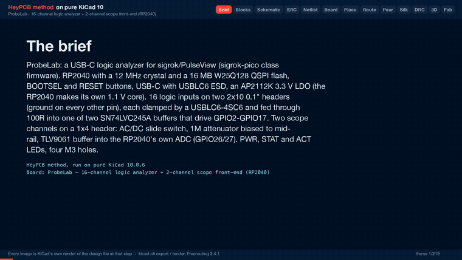

# ProbeLab

An RP2040 USB-C logic analyzer: 16 buffered 5 V-tolerant inputs plus two low-speed scope channels.

| Layers | Size | Parts | Nets | Connections routed | Vias | ERC errors | DRC errors / unconnected / parity |
|---|---|---|---|---|---|---|---|
| 4 | 58 x 70 mm | 88 | 84 | 253 -> 0 open | 171 | 0 | 0 / 0 / 0 |

**Not fabricated, assembled or powered.** Every number on this page is measured by KiCad 10 on the files in this folder; the full measurements are in [`report.json`](report.json).

| | |
|---|---|
| KiCad project | [`kicad/`](kicad/) |
| Gerbers, BOM, CPL, STEP, schematic PDF | [`fab/`](fab/) |
| Renders | [top](media/top.png), [bottom](media/bottom.png) |
| Design process, every step as KiCad rendered it | [`media/design-process.mp4`](media/design-process.mp4) |

ProbeLab is a USB-C logic analyzer meant for sigrok/PulseView with sigrok-pico-style RP2040 firmware. It has 16 buffered and clamped logic inputs and two low-speed scope channels into the RP2040's own ADC, on a 58 x 70 mm, 4-layer board.

It was designed with the HeyPCB method on KiCad 10 (10.0.6), headless. A hand-written brief (`board.json`) is composed from reusable circuit blocks, and one pipeline run then does the schematic, ERC, a netlist round trip, placement, routing with Freerouting 2.4.1, pours and stitching, DRC with schematic parity, a fab gate, the fab outputs, 3D renders and a video. In the heypcb-kicad repository, `./run.sh --board boards/probelab` rebuilds all of it from `board.json`.

**Status: not fabricated, assembled or powered.** The final run passes every gate it has: ERC, the netlist round trip, routing to 0 open, DRC with schematic parity, DFM and the fab gate. That shows the design files agree with each other and with the fab's rules. It does not show that the circuit works.

**Limits.** The scope channels are low speed: they use the RP2040's ADC, 500 kS/s (datasheet) shared between the enabled channels. The logic inputs read 3.3 V and 5 V logic. 1.8 V logic sits below the buffer's 2.0 V VIH and will not read reliably.

**Firmware is separate.** Nothing here contains or tests firmware. The GPIO map below is what a firmware build has to match, and compatibility with sigrok-pico has not been checked on hardware.

## Files

| Path | Contents |
|---|---|
| `board.json` | the brief the pipeline built from |
| `report.json` | the run's measurements; every gate number below comes from it |
| `kicad/` | `probelab.kicad_pro`, `probelab.kicad_sch`, `probelab.kicad_pcb`. `models/` holds a simplified body for the USB-C receptacle, because KiCad 10 ships no 3D model for the HRO TYPE-C-31-M-12. It is not the vendor model |
| `fab/probelab_gerbers.zip` | 4 copper layers, mask, paste, silkscreen, outline, drill and drill map, gerber job |
| `fab/probelab_bom.csv` | 32 lines, 84 parts, each with an LCSC number |
| `fab/probelab_cpl_jlc.csv`, `fab/probelab_pos.csv` | placement for the 81 SMD parts (the through-hole headers are not in them) |
| `fab/probelab_schematic.pdf`, `fab/probelab.step` | schematic and 3D model |
| `media/` | board images and the run recorded stage by stage (`design-process.gif`, `design-process.mp4`) |

## Specs

- **MCU:** RP2040 with a 12 MHz Abracon ABM8-272-T3 crystal (CL 10 pF; 15 pF load caps, 1k on XOUT), the way Raspberry Pi's minimal design wires it.
- **Flash:** W25Q128JVSIQ, 16 MB, QSPI.
- **Core supply:** the RP2040's on-chip regulator makes the 1.1 V core (VREG_VOUT to both DVDD pins, 1 uF at each end of the regulator).
- **Decoupling:** 100 nF on every IOVDD, DVDD, USB_VDD and ADC_AVDD pin and 1 uF on VREG_VIN and VREG_VOUT, all 0402, all on the top side within 2.3 mm of the pin each one serves, each joined to it on F.Cu with no via (measured, see below).
- **USB:** USB-C receptacle (HRO TYPE-C-31-M-12) with 5.1k CC pull-downs, a USBLC6-2SC6 ESD clamp, and 27R in series with D+/D-.
- **Power:** AP2112K-3.3 LDO from VBUS. The draw is expected to stay well under 150 mA. That is an estimate; nothing has been powered.
- **Logic inputs (16, D0-D15):**
  - two 2x10 0.1" headers, signals on the even pins, ground on every odd pin and on pins 18/20;
  - each line clamped at the header by a USBLC6-4SC6 (rail pin on VBUS, so 5 V logic passes);
  - then 100R in series into an SN74LVC245A powered at 3.3 V, fixed A to B (DIR high, OE low), which drives GPIO2-GPIO17;
  - inputs are 5 V tolerant, with thresholds VIH 2.0 V / VIL 0.8 V.
- **Scope inputs (2):** a 1x4 header (CH1, GND, CH2, GND). Each channel has:
  - a PCM12 AC/DC slide switch shorting a 100 nF coupling cap (AC corner about 1.4 Hz);
  - 1M into a node held at mid-rail by 220k/220k, so Vnode = 0.099 x Vin + 1.49 V and about -15 V to +18 V spans 0-3.3 V, with about 1.1 Mohm input resistance;
  - a TLV9061 rail-to-rail buffer, then 47R + 1 nF into the ADC pin.
  - CH1 goes to ADC0 (GPIO26) and CH2 to ADC1 (GPIO27).
- **UI:** BOOT button (QSPI_SS through 1k), RESET button (RUN, 10k pull-up), and three LEDs: PWR (green, 3V3), STAT (GPIO25) and ACT (GPIO24).
- **Board:** 58 x 70 mm with 2 mm corner radii, 4 copper layers (below), every part on the top side. Four M3 holes, each 3.50 mm in from both edges at its corner: a 51 x 63 mm pattern centred on the board. 88 footprints: 84 populated parts and the 4 holes.
- **Silkscreen:** D0-D15 and the two all-ground rows of each header (pins 17-20) are named on both faces, CH1/GND/CH2/GND beside the scope header, BOOT, RST, USB, PWR, STAT and ACT beside their parts, DC and AC beside each switch's throws, and four title lines on the back (name, "16ch logic + 2ch scope", "RP2040 / sigrok", revision). The odd-pin grounds of the outer header column carry no label.

| Function | RP2040 pin(s) |
|---|---|
| D0-D7 (header J2, via U5) | GPIO2-GPIO9 |
| D8-D15 (header J3, via U8) | GPIO10-GPIO17 |
| Scope CH1 / CH2 | GPIO26 (ADC0) / GPIO27 (ADC1) |
| STAT / ACT LED | GPIO25 / GPIO24 |
| BOOT / RESET | QSPI_SS via 1k / RUN |
| Not connected | GPIO0-1, GPIO18-23, GPIO28-29, SWCLK, SWDIO |

## RP2040 decoupling, measured

Read off the final `kicad/probelab.kicad_pcb` with KiCad's Python (`pcbnew`). *Pad to pin* is the distance from the centre of the cap's supply pad (pad 1) to the centre of the RP2040 pin it serves. *Track path* is the shortest run of copper track between the two pads, through vias if any; the 3V3 pour on In1 is not counted. *Before* is the same measurement on the previous build of this board, with the caps where the earlier brief put them.

| Cap | Pin | Supply | Value | Pad to pin | Track path | Before |
|---|---|---|---|---|---|---|
| C1 | 1 | IOVDD | 100 nF | 1.51 mm | 1.61 mm, F.Cu | 1.51 mm, 1.61 mm F.Cu |
| C2 | 10 | IOVDD | 100 nF | 1.63 mm | 1.63 mm, F.Cu | 5.31 mm, 7.68 mm F.Cu |
| C3 | 22 | IOVDD | 100 nF | 1.35 mm | 1.11 mm, F.Cu | 4.89 mm, 13.31 mm F.Cu |
| C4 | 33 | IOVDD | 100 nF | 1.23 mm | 1.23 mm, F.Cu | 2.25 mm, 2.63 mm F.Cu |
| C5 | 42 | IOVDD | 100 nF | 1.23 mm | 1.23 mm, F.Cu | 2.25 mm, 2.63 mm F.Cu |
| C6 | 49 | IOVDD | 100 nF | 1.24 mm | 1.40 mm, F.Cu | 1.34 mm, 1.23 mm F.Cu |
| C7 | 48 | USB_VDD | 100 nF | 2.02 mm | 2.73 mm, F.Cu | 7.74 mm, 23.77 mm through 2 vias |
| C8 | 43 | ADC_AVDD | 100 nF | 2.07 mm | 3.57 mm, F.Cu | 2.16 mm, 2.68 mm F.Cu |
| C9 | 44 | VREG_VIN | 1 uF | 2.24 mm | 5.23 mm, F.Cu | 1.67 mm, 1.98 mm F.Cu |
| C10 | 45 | VREG_VOUT | 1 uF | 1.76 mm | 2.04 mm, F.Cu | 1.37 mm, 1.46 mm F.Cu |
| C11 | 23 | DVDD | 100 nF | 1.58 mm | 1.68 mm, F.Cu | 4.96 mm, 7.29 mm F.Cu |
| C12 | 50 | DVDD | 100 nF | 1.87 mm | 2.00 mm, F.Cu | 9.17 mm, 16.33 mm through 3 vias |

- No cap is on the bottom side, and no cap reaches its pin through a via. A track path can come out shorter than the centre distance, because it is counted from where the track meets each pad.
- The top edge of the QFN carries pins 48-50 between the QSPI pins and the USB pair. The flash is turned (rotation 270 in the brief) so no QSPI line crosses the space above them. C6 sits straight over pins 49 and 48 (both 3V3), C12 up and left of pin 50, C7 up and right of pin 48. The cost is on the right of the USB pair: C10 and C9 moved 0.9 and 0.8 mm right to leave a 1.05 mm channel for the USB lines, so they are 0.39 and 0.57 mm farther from pins 45 and 44 than before.
- **C9's path is long.** Its pad is 2.24 mm from pin 44, but the router joined pins 43/44 to pin 42's cap C5 and the corner cap C8 and reached C9 from C8, so the shortest track from C9 to pin 44 runs 5.23 mm. C8's 3.57 mm path also runs through pin 42 and C5. Two variants of the brief that moved C10 0.1 and 0.2 mm up gave C9 5.12 and 4.33 mm, but cost C1 a 45 mm path through 3 vias or C10 a path through 2 vias, so they were not kept.
- On the left side, C2 sits level with pin 10 in the middle of the GPIO escape. The router takes GPIO6-9 (pins 8, 9, 11 and 12) past it through vias, two of them under the QFN body.
- The bottom pins 22 and 23 have their caps directly under them (C3, C11), right of the XOUT line. R1, the 1k on XOUT, moved 0.3 mm down to make room.

## Stackup and copper

Read off the final `kicad/probelab.kicad_pcb` with KiCad's Python (`pcbnew`); the track lengths and via counts match `report.json`.

| Layer | While routing | After routing | Tracks | Pour fill |
|---|---|---|---|---|
| F.Cu | signal | GND pour | 874.6 mm | 3023 mm² |
| In1.Cu | signal | 3V3 pour | 630.1 mm | 3194 mm² |
| In2.Cu | GND plane (a Specctra power layer, no tracks) | GND pour | none | 3630 mm² |
| B.Cu | signal | GND pour | 290.1 mm | 3440 mm² |

- `board.json` sets one plane, `In2.Cu: GND`. The brief has no `pours` key, so the 3V3 pour on In1 comes from the pipeline's 4-layer pour rule: when no plane carries a supply, the inner signal layer takes the dominant rail after routing. It covers In1's 3V3 tracks.
- 920 tracks, 1794.8 mm. VBUS is 0.4 mm except 6 segments (5.5 mm) at 0.3 mm. 72 segments (57.0 mm in all) are 0.15 mm: short pad exits from Freerouting's fanout solve on 33 nets, which the width floor could not widen without breaking a clearance. Every other track is 0.2 mm, including 3V3, 1V1 and USB D+/D-.
- 171 vias, all through vias of 0.6 mm with a 0.3 mm hole: 114 from routing and 57 GND stitching vias (the stitcher placed 63; the silk stage removed 6 under text).
- 10 of the routing vias sit under the RP2040's body, inside its ring of pins (6 on the previous build).
- `board.keepouts` holds one rule area, `pin_labels_D10_D15`: no vias on any layer in a 3 x 14.5 mm strip under the D10-D15 header labels.
- The gerber job gives four 35 µm copper layers, three 0.48 mm FR4 dielectrics, 1.6 mm overall. That is KiCad's default 4-layer stackup, not a fab's. Nothing on the board is impedance controlled.

## Choices and substitutions

- **The RP2040's own ADC instead of a fast external ADC.** The RP2040 has 30 GPIO, and 16 of them go to the logic inputs.
  - AD9288 (dual 8-bit) has no KiCad 10 symbol.
  - ADC08060 has a symbol, but it is one channel with 8 parallel data lines. Two of them need 16 data pins plus a clock, which does not fit beside 16 logic channels.
  - Two analog nets into GPIO26/27 is by far the most routable option. GPIO26-29 are the RP2040's only ADC pins, so any RP2040 capture firmware reads analog there.
  - The cost: RP2040 ADC bandwidth. Its 500 kS/s (datasheet) is shared between the enabled channels.
- **TLV9061 instead of AD8065 or OPA356.**
  - AD8065 has no KiCad 10 symbol and needs a supply above 3.3 V.
  - OPA356 has a symbol, but it is rail-to-rail on its output only. Its input range stops short of V+, so at 3.3 V it would clip a node biased to mid-rail.
  - TLV9061 is a single-channel SOT-23-5, rail to rail on input and output, 10 MHz, and in stock (C398358).
- **SN74LVC245A, not 74LVC8T245.** It needs one supply and no target-voltage selector. The trade-off: it reads 3.3 V and 5 V logic, but not 1.8 V logic reliably.
- **ABM8-272-T3 (Extended) instead of the Basic C9002 crystal.** C9002 is CL 20 pF. ABM8-272-T3 (CL 10 pF) is the crystal Raspberry Pi's minimal design uses, and 15 pF caps suit it.
- **GND plane on In2, not In1.** Measured on 2026-09-30, on the earlier 56 x 68 mm outline: with In1 as the Specctra power layer, Freerouting left the header ground pins open in every solve (23, 30 and 37 opens, all GND at J2/J3). With In2 as the power layer it closed them. That was before the pipeline started removing plane-layer shapes from through-hole pin padstacks for the router, a change aimed at the same kind of failure. In1 as the plane has not been re-tested since.
- **58 x 70 mm, not 56 x 68.** Once the router was held to the brief's 0.5 mm hole-to-hole spacing between vias, the 56 x 68 mm board left 1V1 open at U1 pin 50 (measured 2026-10-01). At 58 x 70 mm it routed to 0 open.
- **PWR class is VBUS only (0.4 mm).** 3V3 and 1V1 stay at the 0.2 mm default. A 0.3 mm class could not enter the RP2040's 0.2 mm QFN power pins with neckdown off (6 opens until the ladder narrowed it, measured 2026-09-30).
- **QFN-56 ThermalVias footprint.** The exposed pad is the RP2040's only ground pin. The plain footprint leaves it enclosed by 0.4 mm-pitch pins. The symbol's footprint filter allows this variant.
- **Every RP2040 passive is locked in the brief,** and the flash is its own block. Left to the shelf placer, every IOVDD cap landed around the flash (it prefers the IC with fewer pads on the rail). The locks put each supply cap beside its pin with pad 1 toward it. The USB channel between C7 and C10 is 1.05 mm. At 0.9 mm, the bare minimum for two 0.2 mm tracks, the first run of this placement routed every connection, but once the label keep-out was added the fanout solve left U1_DM_MCU open; at 1.05 mm it routes everything (measured 2026-10-01, one run each). Since the keep-out, the fanout-off solve has left VBUS (U7.5 to C16.1) open on every run.
- **The input clamps sit 1.8 mm farther from the headers than before** (pads from 10.0 mm), so the pin labels the silk stage sets inside each signal pad fit on the front. A via-free strip (`board.keepouts`) under the D10-D15 labels keeps router vias off them; without it, two router vias left D10 and D14 unlabelled on both faces.
- **The coupling cap of each scope channel is locked between its switch's input and common rows,** clear of the DC and AC words beside pads 1 and 3. Placed by the shelf placer, it sat where the DC word goes.

New blocks, all prefixed `probe_`:
- `probe_rp2040_core`
- `probe_qspi_flash`
- `probe_logic_bank8`
- `probe_scope_frontend`
- `probe_header_1x04`
- `probe_mounting_holes_m3`

Reused blocks:
- `usb_c_data_5v`
- `usb_esd_usblc6`
- `lipo_ldo_ap2112k` (VBAT renamed onto VBUS)
- `tactile_button`
- `led_indicator`
- `gpio_led`

## Measured gates

The final run, 2026-10-01, with media. Every number is from `report.json`, except the block counts, which are counted in `board.json`.

| Gate | Result |
|---|---|
| Composition | 16 block instances, 12 distinct blocks: 88 parts, 84 nets, 16 no-connect pins |
| Part binding | 84 of 84 populated parts bound to LCSC numbers; the 4 mounting holes are DNP and not in the BOM. 0 unsourced, 0 identity conflicts. 14 distinct Extended parts, about $42 in JLC loading fees |
| ERC (`--severity-all`) | 0 errors, 0 warnings |
| Netlist round trip | identical, 84 nets |
| Placement | 44 parts locked by the brief, 3 edge parts (USB-C, both AC/DC switches), 3 LED-block anchors at brief targets, 38 placed by the shelf placer around the pins they serve |
| Routing | 253 connections, two rung-1 Freerouting solves. **Fanout on: 0 open** in 20.0 s with 114 vias. This solve is kept. Fanout off: 1 open (VBUS, U7.5 to C16.1) in 47.4 s with 78 vias; the last-mile router found no path for it |
| Copper | 920 tracks, 1794.8 mm (F.Cu 874.6, In1.Cu 630.1, B.Cu 290.1) |
| Pours (after a measured 0 open) | GND on F.Cu, B.Cu and In2.Cu, 3V3 on In1.Cu. 63 stitching vias placed, 177 vias in all before the silk stage. 0 open after the pours, after stitching and at the end |
| DRC (`--severity-all --schematic-parity`) | fresh: 0 errors, 0 unconnected, **0 parity issues**, 4 warnings: 3 `lib_footprint_mismatch`, 1 `hole_to_hole` |
| DFM (`jlcpcb_4layer`) | 0 errors, 1 warning: 262 stock-footprint silk strokes at 0.12 mm, which the fab prints at its 0.15 mm minimum |
| Fab gate | **ready**, no blockers. 4 copper gerbers and a gerber job with LayerNumber 4, drill, BOM, CPL (11 rotations corrected), position file, schematic PDF, STEP |
| Silkscreen | 48 header pin labels, 10 words, 57 designators seated, 23 hidden, 13 footprint silk items clipped at the board edge, 4 of 4 back-side title lines placed (as one block, 10 mm left of the brief's spot), 6 stitching vias removed under text |
| Media | 63 3D frames, the raytraced renders and the design-process video all ran; the video is 219 stills at 1920 x 1080, 30 fps, 149.2 s long (measured with ffprobe) |

- **The 3 `lib_footprint_mismatch` warnings** are J1 (USB-C) and SW1/SW2 (PCM12). The silkscreen stage removed the footprint silk that ran past or within 0.3 mm of the board edge: compared with KiCad's library footprints, J1 went from 5 silk items to 2 and each switch from 10 to 5. Those are the 13 clipped items, and they are why the footprints no longer match the library copies.
- **The `hole_to_hole` warning** is a USB_DM via at (42.27, 13.05) and a VBUS via at (42.42, 12.30) mm from the board origin, between the ESD clamp and the LDO: 0.47 mm hole to hole, under the brief's 0.5 mm. The project rates it a warning, so the gate passes; see the check list.
- The project's DRC settings exclude five checks: missing courtyard, track end not centred on a via, footprint filter mismatch, footprint type mismatch, and tuning-profile track geometry.

## Check these before ordering

- **It has never been built.** Nothing here has been fabricated, assembled or powered. Bring up one board rail by rail (VBUS, 3.3 V, the 1.1 V core) before trusting anything else.
- **Stackup.** Replace KiCad's default 4-layer stackup with the fab's own.
- **Logic levels.**
  - The LVC245A at 3.3 V reads 3.3 V and 5 V logic.
  - 1.8 V logic sits below its 2.0 V VIH.
  - Inputs have no pull-downs, so open probes read noise.
- **Back-feeding.** The input clamps' rail pins sit on VBUS. Probing a powered target with the analyzer unplugged can back-feed VBUS through the clamps' steering diodes. Plug in USB first.
- **Analog range and safety.**
  - About -15 V to +18 V (DC coupled), with about 1.1 Mohm input resistance. These are calculated from the values, not measured.
  - Gain and offset depend on 1% resistors, so calibrate in firmware.
  - The 1M is a 0603 rated 75 V, and the coupling cap is 50 V. There is no isolation from the USB host's ground. Do not probe mains.
- **AC/DC lever direction.** Each switch has DC printed beside pad 1, the throw on the input net (common pad 2 to pad 1 shorts the coupling cap), and AC beside pad 3, the unconnected throw, each level with its pad and 2.32 mm to the left of it. Which lever position joins pad 2 to pad 1 has not been checked against the C&K PCM12 datasheet. Check it before trusting the words.
- **Hole spacing.** One pair of vias near the ESD clamp is 0.47 mm hole to hole (DRC warning above). Check it against the fab's minimum hole spacing, or move one via in KiCad.
- **C9's track.** VREG_VIN's 1 uF is 2.24 mm from pin 44 but reaches it by 5.23 mm of track (see the decoupling table). Shorten it in KiCad if the regulator input matters to you.
- **Vias in the RP2040's exposed pad.** The ThermalVias footprint puts four 0.2 mm vias in the exposed pad. They are open holes: order them filled and capped, or expect solder to wick into them.
- **Through-hole headers.** J2, J3 (2x10) and J4 (1x4) are in the BOM but not in the CPL or the position file. Solder them by hand or order through-hole assembly.
- **No debug header.** SWD (SWCLK/SWDIO) and the UART pins (GPIO0/1) are not broken out. Flashing is over USB with BOOT held.
- **USB.** D+/D- are 0.2 mm tracks with no impedance control, and not a coupled pair. D+ runs 10.8 mm from the RP2040 to its 27R through 3 vias (F.Cu, In1, B.Cu, leaving pin 47 under the QFN body) and 33.2 mm on F.Cu from there to the receptacle; D- runs 6.4 mm on F.Cu to its 27R and 27.4 mm through 2 vias (F.Cu, In1) from there. The 10.2 mm length difference is about 0.07 ns, against Full Speed's 83 ns bit time; check it if the board ever moves to a faster interface.
- **Part numbers.**
  - All 84 populated parts are bound to LCSC numbers from heypcb-kicad's pinned parts table. The rows added for this board were read on 2026-09-30 through `heypcb parts search/lookup` (the jlcsearch.tscircuit.com mirror). That mirror carries no manufacturer names.
  - Stock in the table, with its snapshot date: the crystal (C20625731) 18110 on 2026-09-30, the PCM12 switch (C221841) 2789 on 2026-06-25, the PTS810 button (C116501) 1744 on 2026-06-23.
  - Stock and Basic/Extended class go stale. Re-check them on jlcpcb.com.
- **Firmware pin map.** Build the firmware for D0-D15 = GPIO2-17 and the analog channels on GPIO26/27. That this matches a given sigrok-pico release has not been verified.
