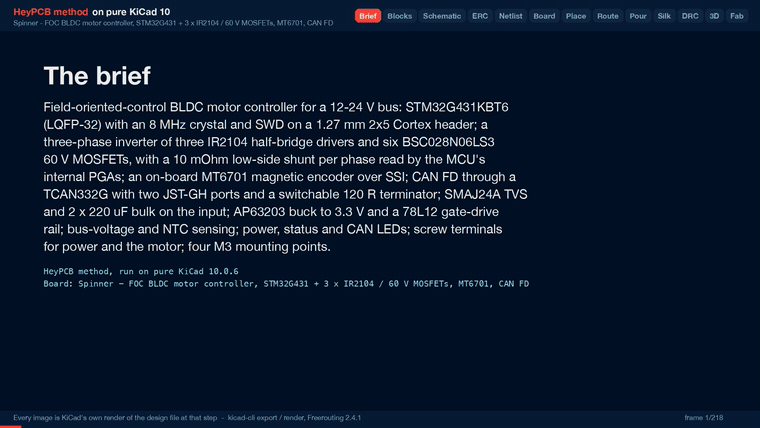

# Spinner

A 12-24 V field-oriented-control BLDC motor controller: STM32G431, three IR2104 half bridges, MT6701 encoder, CAN FD.

<p align="center"></p>

| Layers | Size | Parts | Nets | Connections routed | Vias | ERC errors | DRC errors / unconnected / parity |
|---|---|---|---|---|---|---|---|
| 4 | 84 x 66 mm | 87 | 52 | 205 -> 0 open | 167 | 0 | 0 / 0 / 0 |

**Not fabricated, assembled or powered.** Every number on this page is measured by KiCad 10 on the files in this folder; the full measurements are in [`report.json`](report.json).

| | |
|---|---|
| KiCad project | [`kicad/`](kicad/) |
| Gerbers, BOM, CPL, STEP, schematic PDF | [`fab/`](fab/) |
| Renders | [top](media/top.png), [bottom](media/bottom.png) |
| Design process, every step as KiCad rendered it | [`media/design-process.mp4`](media/design-process.mp4) |

<p align="center"></p>

Spinner is a field-oriented-control (FOC) controller for a three-phase BLDC motor on a 12-24 V
bus. An STM32G431 drives three IR2104 half bridges and six 60 V MOSFETs, reads low-side shunts
through its own PGAs, and has an MT6701 magnetic encoder and CAN FD on the board. It was designed
with the HeyPCB method on KiCad 10 (the headless heypcb-kicad pipeline, routed by Freerouting
2.4.1) from the brief in `board.json`.

**It has not been fabricated, assembled or powered.** It carries no firmware. FOC firmware, such
as SimpleFOC or ST's MCSDK, is a separate project, and so are the timer, PGA and ADC settings that
the sense path below needs. Every gate number below is read from `report.json`. What this README
says about specific nets, pours, pads and silkscreen was read from `kicad/spinner.kicad_pcb` with
KiCad 10.0.6's pcbnew.

- **MCU:** STM32G431KBT6 (LQFP-32, Cortex-M4F, 170 MHz), with an 8 MHz crystal on the HSE and SWD on a 1.27 mm 2x5 Cortex debug header.
- **Inverter:** three IR2104 half-bridge drivers and six BSC028N06LS3 MOSFETs (60 V, 2.8 mOhm, PG-TDSON-8). Each phase takes one PWM input. One shared active-low enable, pulled down, keeps the bridge off while the MCU is in reset.
- **Current sense:** a 10 mOhm 2512 low-side shunt per phase. A 1k / 33k network biases each one onto about 97 mV, for the STM32G431's internal PGAs (OPAMP1/2/3 on PA1/PA7/PB0).
- **Encoder:** an MT6701CT magnetic angle sensor on the board, read over SSI on SPI1. Its MODE pin goes to a GPIO.
- **CAN:** CAN FD through a TCAN332G (3.3 V, 5 Mbps), on two 3-pin JST-GH ports for daisy-chaining. A slide switch puts a 120 R terminator across CANH and CANL.
- **Power:** 12-24 V in on a 5 mm screw terminal, with an SMAJ24A TVS and 2 x 220 uF / 35 V bulk capacitors.
  - A ferrite separates the regulators' input (VM_F) from the motor bus.
  - An AP63203 buck makes 3.3 V.
  - A 78L12 makes the 12 V gate-drive rail.
- **Sensing:** bus voltage through a 100k / 4.7k divider on PA0, and a 10k NTC near the W low side on PA3.
- **Other:** power, status and CAN LEDs; the motor on a 3-way 5 mm screw terminal; four M3 mounting holes.
- **Board:** 84 x 66 mm with 2 mm corners, 4 layers (F.Cu, In1 GND plane, In2 routing + VM pour, B.Cu), 1.6 mm thick in the gerber job.

## Substitutions from the request

| Asked for | On the board | Why |
|---|---|---|
| DRV8316 (integrated FETs and current sense) | 3 x IR2104 + 6 x BSC028N06LS3, plus three 10 mOhm low-side shunts read by the MCU's PGAs | KiCad 10 has no DRV8316 symbol. The integrated three-phase stages it does have are not workable here. The DRV8311 is rated for a 3-20 V supply. The MP6536DU operates at 26 V (28 V absolute maximum, MPS datasheet). Both are 0.4 mm-pitch QFNs whose single 0.2 mm pins cannot take a current-rated track: this pipeline runs Freerouting without neck-down, so a net's class width has to fit every pad on that net. Discrete MOSFETs carry the 1.5 mm motor class on F.Cu end to end. |
| TCAN1044 | TCAN332G (TCAN332GDR) | KiCad 10 has no TCAN1044 symbol. The TCAN332G is in Interface_CAN_LIN, runs CAN FD up to 5 Mbps, and runs from 3.3 V, so the board needs no 5 V rail. |
| STM32G431, LQFP-48 or LQFP-32 | STM32G431KBT6, LQFP-32 | Its 0.8 mm pitch is easier to route. Each function below was read from the symbol's own pin alternates. With the HSE crystal on PF0/PF1, TIM1's three complementary outputs do not all fit this package, so the inverter uses one PWM per phase and the IR2104's internal dead time. |

The MCU pins used (pin names read back from the run's netlist):

| Pin | Net | Function |
|---|---|---|
| PA8 / PA9 / PA10 | PWM_U / PWM_V / PWM_W | TIM1_CH1 / CH2 / CH3 |
| PB5 | DRV_EN | IR2104 ~SD (all three), 100k pull-down. PA15 and PB4 come out of reset with JTAG pull-ups, so neither is used here |
| PA1 / PA7 / PB0 | ISENSE_U / V / W | OPAMP1_VINP / OPAMP2_VINP / OPAMP3_VINP |
| PA0 | VM_SENSE | ADC1_IN1 |
| PA3 | TEMP | ADC1_IN4 |
| PA4 / PA5 / PA6 | ENC_CS / ENC_CLK / ENC_DO | SPI1_NSS / SCK / MISO to the MT6701 (Z/CSN, B/CLK, A/DO) |
| PB4 | ENC_MODE | MT6701 MODE (its 200k pull-up holds it high in reset) |
| PA11 / PA12 | CAN_RX / CAN_TX | FDCAN1 |
| PA13 / PA14 / PB3 / NRST | SWD | SWDIO / SWCLK / SWO / reset |
| PA15 / PB6 | LED_STAT / LED_CAN | red / orange LEDs (the green PWR LED is on 3V3) |
| PB8 | BOOT0 | 4.7k pull-down: boots from flash |

## Measured gates (run of 2026-10-01, from `report.json`)

| Gate | Result |
|---|---|
| Composition | 16 block instances → 87 parts, 52 nets, 10 no-connects |
| Part binding (`lcsc_pinned.json`) | 83 of 87 parts bound to an LCSC number, 0 unsourced, 0 identity conflicts. The four mounting holes (H1-H4) are not in the BOM: there is nothing to buy. 20 distinct Extended parts, about $60 in JLC loading fees |
| ERC (`kicad-cli sch erc --severity-all`) | 0 errors, 0 warnings |
| Netlist round trip | identical, 52 nets |
| Freerouting, rung 1, fanout on (kept) | 205 → **0 open** in 12.4 s, DRC score 0, 78 vias |
| Freerouting, rung 1, fanout off (measured for comparison) | 205 → 0 open in 10.8 s, DRC score 0, 80 vias. On a tie the first solve is kept. Neither solve needed the last-mile router |
| Copper | 734 tracks, 78 routing vias, 2215.3 mm of track (F.Cu 1357.9, In2 754.5, B.Cu 102.8). No class was narrowed: VMBUS and MOTOR stayed at 1.5 mm. After the import, 29 segments were widened to their class width; one 2.54 mm GND segment at the SWD header stays at the 0.15 mm board minimum, because 0.2 mm would not clear |
| Pours (only after a measured 0 open) | GND on F.Cu, In1 and B.Cu; **VM on In2** (`board.pours`); 89 stitching vias (167 vias in all); 0 open after the pour, after stitching and at the end |
| Silkscreen | 10 words, 6 pin labels and the 4 title lines placed; 0 stitching vias displaced; 66 designators re-seated and 12 hidden where nothing fit. The brief's front 12-24V word and J1's + / - marks did not land (see *Check these before ordering*) |
| DRC (`--severity-all --schematic-parity`, KiCad 10.0.6) | fresh, **0 errors, 0 unconnected, 0 parity**, 3 warnings |
| DFM (`jlcpcb_4layer`) | 0 errors, 1 warning (274 stock-footprint silk strokes at 0.12 mm; the fab prints them at its 0.15 mm minimum) |
| Fab gate | **ready**, no blockers; the JLC CPL corrected 9 rotations |

- **The 3 DRC warnings** are all `lib_footprint_mismatch`, on J1, J3 and SW1. The pipeline clipped their footprint silk where it ran past the board edge (11 strokes: 3 on J1, 3 on J3, 5 on SW1). J1 and J3 also carry the generated 3D body below in place of the library's model path.
- **3D bodies on the screw terminals are simplified.** The MaiXu MX126 footprints name a STEP file that the KiCad 10.0.6 install does not have. So J1 and J3 carry generated bodies (`kicad/models/maixu_mx126_5.0_02p.wrl` and `_03p.wrl`): a block over the footprint's fab outline, 10 mm tall, with a screw head over each pin and a wire opening beside it. They are envelopes read off the footprint, not vendor models. They show in the renders, but `fab/spinner.step` has no body for J1 or J3.

## Silkscreen

- **Front:** SWD at the debug header; PWR, STAT and CAN at the three LEDs; ENC at the encoder; MOTOR at the motor terminal; CAN above each GH port (J4's above J4, J5's between the two ports).
- **Terminator switch (SW1):** 120R beside pin 1, the throw that joins the 120 R's free end (U8_TERM, on the common pin) to CANL (U8_CANL); OFF beside pin 3, which is not connected.
- **Motor terminal (J3):** U, V and W beside the pins on the back; on the front only U, because J3's own footprint silk blocks the V and W spots.
- **Supply terminal (J1):** +12-24V beside pin 1 and - beside pin 2, on the back only. See *Check these before ordering*.
- **Back:** the four title lines "Spinner", "FOC BLDC / STM32G431 / CAN FD", "rev A heypcb-kicad" and "12-24 V, not fabricated".

## Check these before ordering

The board passes ERC, the netlist round trip, routing, DRC (errors, unconnected and parity), DFM and the fab gate in KiCad. It has not been fabricated, assembled or powered.

**Current**
- **Track rating.** The VMBUS class (VM) and the MOTOR class (PHASE_U/V/W, LSS_U/V/W) are 1.5 mm wide and declared at `currentA` 3. By the IPC-2221 formula in heypcb-kicad's `route.py` (`ipc2221_amps`), at a 10 C rise, 1.5 mm carries:
  - about 3.2 A on 1 oz outer copper;
  - about 1.0 A on 0.5 oz inner copper (1.6 A at 1 oz inner).
- **Inner copper weight.** The gerber job lists 35 um copper on all four layers. That is KiCad's default stackup, not a fab's. The inner-copper figures here give both 0.5 oz and 1 oz; choose the inner weight when ordering.
- **Vias.** A VMBUS via is 1.2 / 0.7 mm. It carries about 3.4 A at a 10 C rise: the same formula with the outer-layer constant, applied to a barrel of 25 um plating around the 0.7 mm drill. The VMBUS note in `board.json` records why a larger via was not used.
- **Where the copper ran.** This was read from `kicad/spinner.kicad_pcb` with pcbnew, not from report.json. Positions are in mm from the board's top-left corner.
  - All three phases (U 61.2, V 55.9, W 55.3 mm) and all three shunt links (9.8 mm each) are 1.5 mm on F.Cu, with no vias. That copper is 1 oz outer copper end to end.
  - **VM changes layer.** It is 90.8 mm of 1.5 mm track: 75.1 mm on F.Cu and 15.7 mm on In2, between 2 VMBUS vias (1.2 / 0.7 mm). One via is next to C1, at (35.6, 29.8); the other is beside C20, at (40.8, 16.3).
  - Phases V and W, the bulk capacitors, the TVS, the ferrite and J1 are joined on F.Cu. Phase U's high side (Q1's drain, C19, C20) reaches the rest of VM only through In2 and the via beside C20. That one via carries all of phase U's high-side current: about 3.4 A of rating against the 3 A class.
  - The In2 stretch lies wholly inside the In2 VM pour; it is not a lone inner track. Measured square to the track every 0.1 mm, more than 1 mm from either via, the poured copper around it is at least 13.0 mm wide; at the via beside C20 it is 5.1 mm. The narrowest cut through the In2 VM copper between the two vias is at least 8.6 mm (a max-flow on a 0.1 mm raster, which can only undercount). Treated as a track, 8.6 mm is about 3.4 A at 0.5 oz inner (5.7 A at 1 oz) by the same formula. A lone 1.5 mm inner track would carry the 1.0 A above.
  - The In2 VM pour is 4417 mm² after fill, in one island. It joins VM at J1 pin 1 (thermal spokes; this is the only through-hole VM pad), at both VM vias and along all of VM's In2 track.
- **Silicon and connectors.**
  - MOSFETs: 100 A in the KiCad symbol's description.
  - Terminals: 10 A per contact, from the MX126 catalogue rows.
  - JST-GH: 1 A per contact (catalogue row).
  - Shunts: 10 mOhm, 3 W.
  - None of these is the limit; the copper is.
- **Current-sense range.** At PGA gain 16 the bias sits near 1.55 V, which gives roughly +-10 A full scale. The gain and offset are firmware choices. Low-side shunts read phase current only while each low-side MOSFET conducts, so sample in the PWM centre.

**Thermal**
- **MOSFETs.** There are no thermal vias under the drain pads, because the stock TDSON-8-1 footprint has none, and no heatsink. These are estimates from datasheet and catalogue values, not measurements:
  - conduction loss is small (2.8 mOhm at 3 A is about 25 mW per FET);
  - switching loss dominates. The IR2104 drives 130 mA / 270 mA (catalogue row) into about 31 nC of gate charge, so the edges take a few hundred ns: roughly 0.25 W per hard-switched FET at 24 V, 3 A and 20 kHz.
  - Watch TH1, the NTC near the W low side.
- **Regulators.**
  - The 78L12 drops (VM - 12 V) at a few mA of gate current: about 50 mW at 24 V.
  - The AP63203's load is the logic: on the order of 100 mA (an estimate, not measured) against its 2 A rating.

**Voltage**
- **Upper limit: 24 V nominal; a 6S pack at 25.2 V is fine.**
  - The TVS breaks down between 26.7 and 29.5 V and clamps at 38.9 V at 10.3 A (SMAJ24A catalogue rows).
  - The electrolytics, the AP63203 (absolute maximum) and the 78L12 (catalogue row) are all 35 V parts.
  - The bootstrap diodes are 40 V and the MOSFETs 60 V.
  - **Regenerative braking can pump the bus up**: limit regen in firmware or add a brake resistor.
- **Lower limit: 12 V.** The 78L12 drops out (1.7 V) to about 10.3 V there. That is the bottom of the IR2104's 10-20 V supply range; below a 12 V bus the gate drive is out of specification.
- **No reverse-polarity protection and no fuse.** A reversed supply forward-biases the TVS. Fuse the supply lead.
- **J1's polarity is printed on the back only.** The back reads +12-24V beside pin 1 (VM) and - beside pin 2 (GND). The - sits between the two pins, nearer pin 2. On the front, pin 1 is marked only by the footprint's pin-1 triangle, for three reasons:
  - The brief's + / - marks (`silk.polarity`) do not land: every spot the silk stage tries is 1.9-2.3 mm from the pad centre and overlaps J1's 2.8 mm pads.
  - The front pin labels hit J1's own footprint silk.
  - The brief's front 12-24V word (`silk.words`) finds no free spot: L1, D1, J1's pin-1 mark, a routed VM_F via and the board edge surround the terminal.

  Reserving that spot with a via keep-out was tried. The reroute it caused put phase U's sense line (ISENSE_U) on In2 beside VM's stretch and cut the In2 copper between the two VM vias to about 2.5 mm, so the brief does not do it. Mark the supply lead.
- **IR2104 logic threshold.** VIH is 3.0 V minimum, and the MCU drives 3.3 V: a 0.3 V margin.

**Mechanics and sourcing**
- **Encoder.** The MT6701 sits in the lower-left logic area, marked ENC. The motor's diametric magnet (6 mm x 2.5 mm recommended) has to sit 0.5-2.0 mm above the package centre, within 0.3 mm (MagnTek datasheet). Plan the motor mount around it.
- **CAN.** The GH pin order (1 CANH, 2 CANL, 3 GND) is this board's own choice. Check it against your cables. SW1's words name its throws: 120R beside pin 1, the throw that terminates the bus, and OFF beside pin 3. Which slider position closes which throw was not checked against the PCM12 datasheet.
- **Part numbers.** All 36 part numbers in `fab/spinner_bom.csv` come from heypcb-kicad's pinned catalogue table: 23 rows dated 2026-09-30 (22 of them marked as live lookups) and 13 dated 2026-06-23 to 2026-07-03. Stock and Basic/Extended class go stale; re-check before ordering. The TCAN332GDR (stock 253) and the SM03B-GHS-TB (stock 494) had the lowest stock of those rows.

## Files

- `board.json`: the brief the pipeline built everything here from.
- `report.json`: the run's gate report, the source of every gate number above.
- `kicad/`: `spinner.kicad_pro`, `spinner.kicad_sch`, `spinner.kicad_pcb` (routed and poured) and `models/` (the two generated terminal bodies).
- `fab/spinner_gerbers.zip`: 11 layer gerbers, the gerber job, the drill file and the drill map.
- `fab/spinner_bom.csv` (36 part rows, 83 parts), `fab/spinner_cpl_jlc.csv` (JLC placement for the 81 SMD parts, rotations corrected; the through-hole J1 and J3 are not in it), `fab/spinner_pos.csv` (KiCad placement), `fab/spinner_schematic.pdf`, `fab/spinner.step`.
- `media/`: `hero.png`, `top.png`, `bottom.png` and the design-process video (`design-process.mp4`, `design-process.gif`).

## Reproduce

From the heypcb-kicad repository:

```bash
./run.sh --board boards/spinner              # every stage, with the 3D renders and the video
./run.sh --board boards/spinner --no-media   # stop before the 3D frames, renders and video
```

Placement walks parts in reference order, and the Specctra file is written in an order set by
content alone. So the brief is meant to place and route the same way every time. The final brief
was built three times on 2026-10-01: once from the board stage and twice in full, the last with
media. All three routed 205 → 0 open with the same copper (734 tracks, 78 vias, 2215.3 mm) and
placed the same silkscreen. The two full runs gave the same copper and silkscreen measurements
here; only the solve times differed, by 0.1 s.
